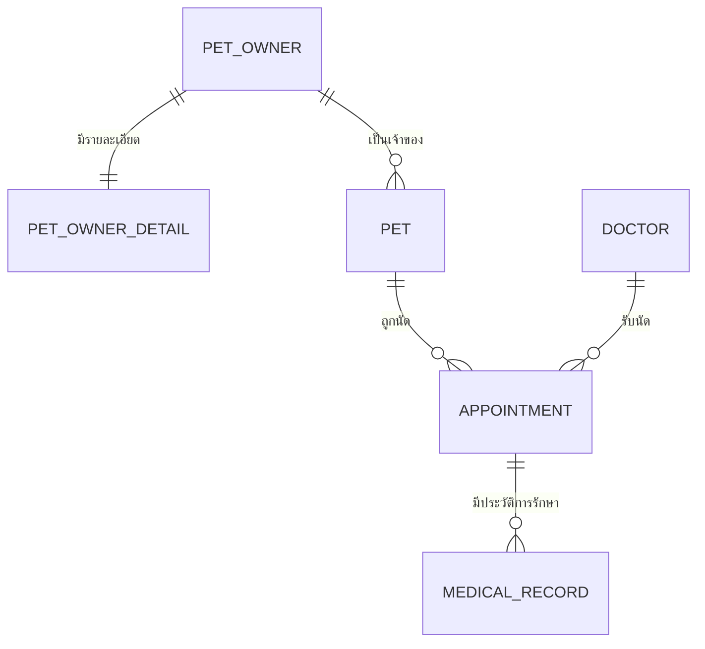

## Pet Clinic Appointment & Vaccination System
### ระบบบริหารจัดการนัดหมายและประวัติการฉีดวัคซีนสำหรับคลินิกสัตว์เลี้ยง ###
**รายละเอียด:** ระบบจัดการข้อมูลและการนัดหมายสำหรับคลินิกสัตว์เลี้ยง **PawCare Pet Clinic & Vaccination** ที่พัฒนาด้วย Java 17 และ Spring Boot ตามสถาปัตยกรรมแบบ Layered Architecture เพื่อช่วยให้เจ้าของสัตว์เลี้ยงสามารถจัดการข้อมูลสัตว์เลี้ยง นัดหมายกับสัตวแพทย์ และตรวจสอบสถานะการนัดหมายได้อย่างสะดวก ตลอดจนช่วยเจ้าหน้าที่และสัตวแพทย์ให้จัดการตารางนัดและบันทึกประวัติการรักษาและการฉีดวัคซีนได้อย่างเป็นระบบ เพื่อลดความซ้ำซ้อนของข้อมูลและเพิ่มประสิทธิภาพในการบริการ

---

## สมาชิกกลุ่ม (Group Members) - กลุ่มที่ 11 (Section 04)

| ลำดับ | ชื่อ-นามสกุล | รหัสนักศึกษา | Section | Branch | หน้าที่รับผิดชอบ |
| --- | --- | --- | --- | --- | --- |
| 1 | นายสิทธิโชค มุขนาค | 673380428-6 | 04 | `sitthichok_6733804286_04` | โมดูลสัตวแพทย์ (Doctor) Doctor CRUD + หน้าเว็บ + Unit Test, Singleton, Docker |
| 2 | นายณัฐภัทร ฉ่ำตะคุ | 673380583-4 | 04 | `Nathapat_6733805834_04` | โมดูลนัดหมาย (Appointment): ค้นแฟ้มด้วยเบอร์โทร ตรวจคิวว่าง จอง เลื่อน ยกเลิก ยืนยันและปิดนัด,+ Factory Method + Frontend Test |
| 3 | นางสาวพิชยา สิทธิพันธ์ | 673380596-5 | 04 | `pitchaya_6733805965_04` | โมดูลเจ้าของสัตว์เลี้ยง (PetOwner, PetOwnerDetail) + DTO/Mapper, Global Exception Handler, การตรวจสิทธิ์, My Pets, README / Data Dictionary / Diagrams, Deploy |
| 4 | นายสรวิศ สุคงเจริญ | 673380606-8 | 04 | `soravit_6733806068_04` | โมดูลสัตว์เลี้ยง (Pet): Entity, Repository, Service, Validation และ Unit Test, หน้า My Pets เวอร์ชันแรก |
| 5 | นางสาวอมลวรรณ พิมพิชัย | 673380608-4 | 04 | `amonwan_6733806084_04` | โมดูลประวัติการรักษาและวัคซีน (MedicalRecord) + Builder Pattern, ระบบรหัสเจ้าหน้าที่ (Staff Passcode) และล็อกเมื่อกรอกผิด, ย้ายหน้าสัตวแพทย์มาใช้ฐานข้อมูลและจำกัดสิทธิ์ API สัตวแพทย์, สไลด์นำเสนอ |

---

## วัตถุประสงค์ (Objectives)
1. เพื่อพัฒนาระบบจัดการข้อมูลเจ้าของสัตว์เลี้ยงและสัตว์เลี้ยง
2. เพื่ออำนวยความสะดวกในการนัดหมายระหว่างเจ้าของสัตว์เลี้ยงกับสัตวแพทย์
3. เพื่อให้สัตวแพทย์สามารถจัดการข้อมูลการนัดหมายและบันทึกประวัติการรักษาได้
4. เพื่อจัดเก็บประวัติการรักษาและการฉีดวัคซีนของสัตว์เลี้ยงอย่างเป็นระบบ
5. เพื่อประยุกต์ใช้ Design Patterns ในการออกแบบและพัฒนาซอฟต์แวร์

---

## ฟังก์ชันและโครงสร้างหน้าเว็บ (Core Screens & Features)
ระบบกำหนดโครงสร้างหน้าจอหลักไว้ดังนี้ (ทุกหน้าใช้แถบเมนูเดียวกัน: Home, Owners, My Pets, Appointments, Veterinarians, Staff Only และเมนู Medical Records จะแสดงเมื่อเข้าสู่ระบบเจ้าหน้าที่):

* **หน้าหลัก / แดชบอร์ด (Home / Dashboard) `/`:** หน้าต้อนรับ ทางลัดไปจองนัดหมาย สัตว์เลี้ยงของฉัน ข้อมูลเจ้าของ และรายชื่อสัตวแพทย์ พร้อมข้อมูลติดต่อคลินิก
* **หน้าข้อมูลเจ้าของสัตว์เลี้ยง (Pet Owner Page) `/owners`:** ลงทะเบียนเจ้าของใหม่ ค้นหาด้วยเบอร์โทร ดูแฟ้มเจ้าของพร้อมรายการสัตว์เลี้ยง แก้ไขข้อมูล ส่วนหน้า `/owners/staff` สำหรับเจ้าหน้าที่ใช้ดูรายชื่อทั้งหมด แบ่งหน้า เรียงลำดับ และลบข้อมูล
* **หน้าจัดการข้อมูลสัตว์เลี้ยง (Pet Management Page) `/pets`:** เจ้าของดู เพิ่ม แก้ไข และลบสัตว์เลี้ยงของตัวเอง กรองตามประเภท (สุนัข / แมว / อื่น ๆ) เจ้าหน้าที่ดูสัตว์เลี้ยงทั้งหมดในคลินิก
* **หน้าระบบนัดหมาย (Appointment Page) `/appointments`:** จองคิว เลือกสัตว์เลี้ยง เลือกสัตวแพทย์ เลือกวันและช่วงเวลาว่าง เลือกประเภทบริการ (ตรวจรักษา / ฉีดวัคซีน / ผ่าตัด) เลื่อนหรือยกเลิกนัด เจ้าหน้าที่ยืนยันและปิดนัด
* **หน้ารายชื่อสัตวแพทย์ (Veterinarians) `/doctors`:** รายชื่อสัตวแพทย์ ความเชี่ยวชาญ ตารางเวรรายวันและรายสัปดาห์ เวลาเปิดทำการและค่าบริการ ปุ่มจองนัดกับแพทย์ที่เลือก
* **หน้าประวัติการรักษาและวัคซีน (Medical & Vaccination Record Page) `/medical-records`:** เจ้าหน้าที่บันทึก ดู แก้ไข และลบประวัติการรักษา การวินิจฉัย การฉีดวัคซีน และวันนัดฉีดวัคซีนครั้งถัดไป (บันทึกได้เฉพาะนัดที่เสร็จสิ้นแล้ว)

---

## ขอบเขตฟังก์ชันแบ่งตามสิทธิ์ผู้ใช้
**สำหรับเจ้าของสัตว์เลี้ยง (Pet Owner):**
* จัดการข้อมูลส่วนตัวและข้อมูลติดต่อ
* เพิ่มและจัดการข้อมูลสัตว์เลี้ยง
* ค้นหาและดูข้อมูลสัตวแพทย์
* ส่งคำขอนัดหมายและตรวจสอบสถานะการนัดหมาย
* ดูประวัติการรักษาและประวัติการฉีดวัคซีนของสัตว์เลี้ยง

**สำหรับสัตวแพทย์ (Doctor):**
* ดูรายการนัดหมายและจัดการตารางนัดหมาย
* ตรวจสอบ/อนุมัติคำขอนัดหมาย
* ค้นหาข้อมูลและประวัติสัตว์เลี้ยง
* บันทึกประวัติการรักษาและข้อมูลการฉีดวัคซีน

*หมายเหตุ: ระบบไม่มีการสมัครบัญชีผู้ใช้ เจ้าของสัตว์เลี้ยงเข้าถึงแฟ้มของตนด้วยเบอร์โทรศัพท์ ส่วนสัตวแพทย์และเจ้าหน้าที่ใช้รหัสเจ้าหน้าที่ 8 หลักร่วมกันที่หน้า Staff Only ปัจจุบันประวัติการรักษาและวัคซีนเปิดให้ดูผ่านหน้าเว็บเฉพาะเจ้าหน้าที่*

---

## Tech Stack

* **Programming Language:** Java 17
* **Backend Framework:** Spring Boot 4.1 (Spring Web MVC, Spring Data JPA, Spring Validation)
* **Build Tool:** Maven (ใช้ Maven Wrapper `mvnw` ที่อยู่ในโปรเจกต์)
* **Database:** PostgreSQL
* **ORM:** Spring Data JPA (Hibernate)
* **Frontend:** Thymeleaf + HTML5 / CSS3 / JavaScript (PawCare Design System: `pawcare.css`, `icons.css` ไอคอน Phosphor, ฟอนต์ Prompt)
* **API Documentation:** OpenAPI 3 / Swagger UI (springdoc-openapi)
* **Testing Framework:** JUnit 5, Mockito, Spring Boot Test (`@WebMvcTest`, `@DataJpaTest`)
* **Containerization:** Docker และ Docker Compose
* **Development Environment:** Visual Studio Code (VS Code)

---

## System Architecture

```text
Presentation Layer (RestController /api/v1/... + Thymeleaf View Controller)
       ↓
Service Layer (Business Logic & Transaction Management)
       ↓
Repository Layer (Data Access - Spring Data JPA)
       ↓
Domain / Entity Layer (Entities, Enums) + DTO Layer (Request/Response DTO + Mapper)
```

* ทุกคำขอที่ผิดพลาดถูกจัดการรวมที่ `GlobalExceptionHandler` และตอบกลับรูปแบบเดียวกัน (400 / 403 / 404 / 409)
* สิทธิ์เจ้าหน้าที่และเจ้าของแฟ้มตรวจที่ฝั่ง Backend ผ่าน `StaffAccess` (เก็บสถานะใน HTTP Session)

### กระบวนการทำงานของระบบแบ่งตามสิทธิ์ผู้ใช้งาน (Role-based Workflows):

1. **กระบวนการสำหรับสัตวแพทย์และเจ้าหน้าที่ (Doctor Flow):** กรอกรหัสเจ้าหน้าที่ 8 หลักที่หน้า Staff Only (กรอกผิด 3 ครั้งภายใน 10 นาทีจะถูกล็อกชั่วคราว) → ดูรายชื่อเจ้าของและสัตว์เลี้ยงทั้งหมด → ดูนัดหมายของคลินิก ยืนยันนัด (`PENDING` → `CONFIRMED`) และปิดนัดเมื่อตรวจเสร็จ (`CONFIRMED` → `COMPLETED`) → บันทึกประวัติการรักษาและการฉีดวัคซีนของนัดที่เสร็จสิ้น → จัดการข้อมูลสัตวแพทย์และตารางเวร
2. **กระบวนการสำหรับเจ้าของสัตว์เลี้ยง (Pet Owner Flow):** ค้นหาแฟ้มด้วยเบอร์โทรศัพท์ที่หน้า Owners (ถ้ายังไม่มีให้ลงทะเบียนใหม่) → เพิ่มและจัดการสัตว์เลี้ยงที่หน้า My Pets → ดูรายชื่อและตารางเวรสัตวแพทย์ → จองนัดหมายโดยเลือกสัตว์ แพทย์ วันเวลาว่าง และประเภทบริการ → ตรวจสอบสถานะ เลื่อน หรือยกเลิกนัดหมาย

---

## โครงสร้างฐานข้อมูล (Database Design)


โครงสร้างฐานข้อมูลเชิงสัมพันธ์ (Relational Database) ประกอบด้วย 6 ตารางหลัก รองรับความสัมพันธ์ประเภท **One-to-One** และ **One-to-Many** ดังนี้:

1. **`PetOwner`:** จัดเก็บข้อมูลหลักของเจ้าของสัตว์เลี้ยง (ชื่อ อีเมล เบอร์โทรศัพท์ที่ใช้ค้นหาแฟ้ม)
2. **`PetOwnerDetail`:** *(One-to-One กับ PetOwner)* จัดเก็บข้อมูลเชิงลึก ได้แก่ ที่อยู่ และเบอร์โทรศัพท์ติดต่อฉุกเฉิน
3. **`Pet`:** *(One-to-Many จาก PetOwner)* จัดเก็บข้อมูลประวัติสัตว์เลี้ยง (ประเภท, สายพันธุ์, เพศ, น้ำหนัก, วันเกิด, หมายเลขไมโครชิป)
4. **`Doctor`:** จัดเก็บข้อมูลสัตวแพทย์ รายละเอียดความเชี่ยวชาญ และตารางเวลาการปฏิบัติงาน (ตารางเวร)
5. **`Appointment`:** *(One-to-Many จาก Pet และ Doctor)* จัดเก็บข้อมูลการนัดหมาย วันเวลา รายละเอียดอาการเบื้องต้น ประเภทบริการ และสถานะ
6. **`MedicalRecord`:** *(One-to-Many จาก Appointment)* จัดเก็บประวัติผลการตรวจรักษา การรักษา และการฉีดวัคซีนจริง



*(หมายเหตุ: รายละเอียดทุกคอลัมน์ ชนิดข้อมูล Key และกฎการตรวจสอบข้อมูลอยู่ใน [`doc/data-dictionary.md`](doc/data-dictionary.md) ส่วนแผนภาพทั้งหมดอยู่ในโฟลเดอร์ [`doc/diagrams/`](doc/diagrams/))*

| แผนภาพ | ไฟล์ | แสดงอะไร |
| --- | --- | --- |
| ER Diagram | [`er-diagram.md`](doc/diagrams/er-diagram.md) | 6 ตาราง คอลัมน์ PK / FK / UK และความสัมพันธ์ |
| Use Case Diagram | [`use-case-diagram.md`](doc/diagrams/use-case-diagram.md) | สิ่งที่เจ้าของสัตว์เลี้ยงและเจ้าหน้าที่ / สัตวแพทย์ทำได้ |
| Class Diagram | [`class-diagram.md`](doc/diagrams/class-diagram.md) | Entity, Enum และคลาสที่ใช้ Design Pattern |
| Sequence Diagram | [`sequence-diagram.md`](doc/diagrams/sequence-diagram.md) | ขั้นตอนจองนัดหมาย และบันทึกประวัติการรักษา |
| State Diagram | [`state-diagram.md`](doc/diagrams/state-diagram.md) | การเปลี่ยนสถานะของนัดหมาย |

---

## การนำ Design Patterns มาใช้งาน (Design Patterns Applied)

เพื่อแก้ปัญหาในการออกแบบเชิงวัตถุให้สอดคล้องกับข้อกำหนดทางเทคนิค:

| Pattern | Group | วัตถุประสงค์และการประยุกต์ใช้งานในระบบ |
| --- | --- | --- |
| **Factory Method** | Creational | `AppointmentFactory` มี Factory แยกตามประเภทบริการ ได้แก่ `ConsultationAppointmentFactory`, `VaccineAppointmentFactory` และ `SurgeryAppointmentFactory` แต่ละตัวสร้างนัดหมายพร้อมคำแนะนำการเตรียมตัวของบริการนั้น โดย `AppointmentFactoryRegistry` เลือก Factory ตาม `ServiceType` |
| **Builder Pattern** | Creational | `MedicalRecord.Builder` ใช้ประกอบวัตถุประวัติการรักษาที่มีหลายฟิลด์ไม่บังคับ (การวินิจฉัย การรักษา วัคซีน วันนัดครั้งถัดไป หมายเหตุ) ให้อ่านง่ายและไม่ต้องใช้ Constructor ยาว ใช้ใน `MedicalRecordServiceImpl` |
| **Singleton Pattern** | Creational | `ClinicConfigService` เก็บข้อมูลคลินิก เวลาเปิดทำการ และอัตราค่าบริการ เป็น Spring Bean แบบ Singleton มี Instance เดียวตลอดการทำงาน ตรวจสอบได้ที่ `GET /api/v1/config/singleton-check` (รายละเอียดใน [`doc/singleton-pattern.md`](doc/singleton-pattern.md)) |
| **DTO + Mapper** | Enterprise | แยก Entity ออกจากข้อมูลที่รับ-ส่งผ่าน API เช่น `PetOwnerRequestDTO`, `PetOwnerResponseDTO` และ `PetOwnerMapper` ทำหน้าที่แปลงข้อมูลแยกจาก Service |

---

## การติดตั้งและเริ่มต้นใช้งาน (Installation & Setup)

**สิ่งที่ต้องติดตั้ง**
* Java Development Kit (JDK) 17 ขึ้นไป
* Docker Desktop (สำหรับรัน PostgreSQL)
* Git
* Visual Studio Code (VS Code)
* ไม่ต้องติดตั้ง Maven เพราะใช้ Maven Wrapper (`mvnw`) ที่อยู่ในโปรเจกต์


### ขั้นตอนที่ 1: การ Clone Repository
```bash
git clone https://github.com/pitchayasitthipan/vet-appointment-system.git
cd vet-appointment-system
```

### ขั้นตอนที่ 2: การกำหนดค่าฐานข้อมูล (Database Configuration)

* ค่าการเชื่อมต่อฐานข้อมูลอยู่ใน `code/src/main/resources/application.properties` และอ่านค่าจาก Environment Variable ได้ (`DB_HOST`, `DB_PORT`, `DB_NAME`, `DB_USERNAME`, `DB_PASSWORD`)
* ค่าเริ่มต้น: ฐานข้อมูล `petclinic_db` ที่ `localhost:5432` ผู้ใช้ `postgres` รหัสผ่าน `postgres` (ตรงกับ `docker-compose.yml`)
* Hibernate สร้างตารางให้อัตโนมัติ (`spring.jpa.hibernate.ddl-auto=update`)
* ข้อมูลตัวอย่างสัตวแพทย์ 5 ท่านอยู่ใน `code/src/main/resources/data-doctor.sql` Docker Compose โหลดให้อัตโนมัติเมื่อสร้างฐานข้อมูลครั้งแรก (ถ้าต้องการโหลดใหม่ ใช้ `docker compose down -v` แล้ว `docker compose up -d` ข้อมูลเดิมในฐานจะหาย)
* ไม่ควรเผยแพร่รหัสผ่านหรือข้อมูลสำคัญของระบบจริงลงใน Repository

**หมายเหตุสำหรับฐานข้อมูลเดิม:** ตาราง `medical_record` มี Foreign Key ชื่อ `fk_medical_record_appointment` ที่อ้างอิงตาราง `appointment` หากฐานข้อมูลเดิมมีประวัติการรักษาที่อ้างอิงรหัสนัดหมายซึ่งไม่มีอยู่จริง Hibernate จะสร้าง Foreign Key ไม่ได้ (ขึ้นเพียง WARN ใน log) ตรวจสอบข้อมูลที่อ้างอิงไม่ถูกต้องด้วยคำสั่ง:

```sql
SELECT mr.medical_record_id, mr.appointment_id
FROM medical_record mr
LEFT JOIN appointment a
    ON mr.appointment_id = a.appointment_id
WHERE a.appointment_id IS NULL;
```

หากพบข้อมูล ให้สำรองฐานข้อมูลก่อน แล้วแก้ไขหรือลบเฉพาะข้อมูลที่ตรวจสอบแล้ว หรือสร้างฐานข้อมูลใหม่

### ขั้นตอนที่ 3: ตั้งค่ารหัสเจ้าหน้าที่ (STAFF_PASSCODE)

ระบบ PawCare ใช้รหัสผ่านสำหรับเจ้าหน้าที่ (Staff) เป็นตัวเลข 8 หลัก โดยอ่านค่าจาก Environment Variable ชื่อ `STAFF_PASSCODE` แทนการกำหนดรหัสเริ่มต้นไว้ใน Source Code เพื่อป้องกันการใช้รหัสที่เดาได้ง่าย

**กรณีรันโปรเจกต์บน macOS / Linux**

เปิด Terminal ในโฟลเดอร์ `code` แล้วรัน:

```bash
read -s "STAFF_PASSCODE?กรอกรหัส Staff 8 หลัก: " && echo && export STAFF_PASSCODE
./mvnw spring-boot:run
```

คำสั่ง `read -s` ด้านบนใช้กับ Zsh (macOS) โดยจะไม่แสดงรหัสขณะพิมพ์ สำหรับ Bash ให้ใช้ `read -rs -p "กรอกรหัส Staff 8 หลัก: " STAFF_PASSCODE; echo; export STAFF_PASSCODE` แทน

**กรณีรันโปรเจกต์บน Windows PowerShell**

```powershell
$secure = Read-Host "กรอกรหัส Staff 8 หลัก" -AsSecureString
$env:STAFF_PASSCODE = [System.Net.NetworkCredential]::new("", $secure).Password
.\mvnw.cmd spring-boot:run
```

**กรณี Deploy ด้วย Docker Compose**

`docker-compose.yml` ส่งตัวแปร `STAFF_PASSCODE` เข้า Container ของแอปแล้ว:

```yaml
environment:
  STAFF_PASSCODE: ${STAFF_PASSCODE:?Please set STAFF_PASSCODE}
```

จากนั้นตั้งค่า `STAFF_PASSCODE` บนเครื่องที่รัน Docker Compose ก่อนสั่ง `docker compose up --build`

**ข้อควรระวัง**

- ใช้รหัสตัวเลข 8 หลักที่กำหนดเอง ไม่ใช้รหัสที่เดาง่าย เช่น `12345678`
- ห้าม Commit รหัสจริงลง GitHub หรือเขียนไว้ใน README
- ผู้ที่เปิดเว็บผ่าน Browser ไม่จำเป็นต้องตั้ง Environment Variable เพียงกรอกรหัส Staff ที่คลินิกกำหนด
- หาก Clone โปรเจกต์ไปรันบนเครื่องอื่น ต้องตั้งค่านี้ในเครื่องที่รันแอปด้วย
- ระบบจะล็อกการลองรหัสชั่วคราวเมื่อกรอกผิดครบ 3 ครั้งภายใน 10 นาที
- ต้องตั้งค่า STAFF_PASSCODE ก่อนเรียก Docker Compose มิฉะนั้น Compose จะแจ้งข้อผิดพลาดและไม่เริ่มระบบ

---

## How to Run

### วิธีที่ 1: รันฐานข้อมูลด้วย Docker แล้วรันแอปผ่าน Maven Wrapper

```bash
# เริ่มฐานข้อมูล PostgreSQL (รันที่โฟลเดอร์หลักของโปรเจกต์)
docker compose up -d db

# รันระบบ (ตั้งค่า STAFF_PASSCODE ตามขั้นตอนที่ 3 ก่อน)
cd code
./mvnw spring-boot:run
```

### วิธีที่ 2: รันทั้งระบบผ่าน Docker Compose

```bash
docker compose up --build
```

เปิดใช้งานที่ `http://localhost:8080`

| หน้า | URL |
| --- | --- |
| Home | `http://localhost:8080/` |
| Owners (ค้นหาแฟ้มด้วยเบอร์โทร / ลงทะเบียน) | `http://localhost:8080/owners` |
| My Pets | `http://localhost:8080/pets` |
| Appointments | `http://localhost:8080/appointments` |
| Veterinarians | `http://localhost:8080/doctors` |
| Medical Records (เจ้าหน้าที่) | `http://localhost:8080/medical-records` |
| Staff Only | `http://localhost:8080/owners/staff` |

---

## API Documentation

เมื่อระบบเริ่มต้นการทำงานเรียบร้อยแล้ว สามารถเข้าถึงเอกสารและทดสอบการทำงานของ RESTful API ผ่าน Swagger UI ได้ที่:

* **Swagger UI URL:** `http://localhost:8080/swagger-ui.html`
* **OpenAPI JSON:** `http://localhost:8080/v3/api-docs`

ทุก API ใช้ Prefix `/api/v1` รายการที่แก้ไขข้อมูลตรวจสิทธิ์ที่ Backend (ไม่มีสิทธิ์ตอบ 403):

| Resource | Endpoint หลัก | สิทธิ์ |
| --- | --- | --- |
| เจ้าของสัตว์เลี้ยง | `GET/POST /api/v1/owners`, `GET /api/v1/owners/search`, `GET/PUT/DELETE /api/v1/owners/{id}` | ลงทะเบียนได้ทุกคน, ค้นหาด้วยเบอร์ของตัวเองได้, ดูรายชื่อทั้งหมด/แก้ไข/ลบผ่าน API เฉพาะเจ้าหน้าที่ |
| สัตว์เลี้ยง | `GET /api/v1/pets?keyword=&species=` (ค้นหาทั้งคลินิก + แบ่งหน้า), `POST /api/v1/pets`, `GET /api/v1/pets/owner/{ownerId}`, `GET/PUT/DELETE /api/v1/pets/{id}` | เจ้าของแฟ้มหรือเจ้าหน้าที่, ดูและค้นหาทั้งหมดได้เฉพาะเจ้าหน้าที่ |
| สัตวแพทย์ | `GET /api/v1/doctors` (แบ่งหน้า), `GET /api/v1/doctors/all`, `GET /api/v1/doctors/{id}`, `POST/PUT/DELETE /api/v1/doctors/...` | ดูได้ทุกคน, เพิ่ม/แก้ไข/ลบเฉพาะเจ้าหน้าที่ |
| ค้นหาแฟ้มก่อนจองนัด | `POST /api/v1/appointment-guests/lookup`, `GET /api/v1/appointment-guests/{ownerId}/pets`, `GET /api/v1/appointment-guests/me`, `GET /api/v1/appointment-guests/config` | ทุกคน (ค้นด้วยเบอร์โทร แล้วจำแฟ้มไว้ใน Session) |
| นัดหมาย | `POST/GET /api/v1/appointments`, `GET /api/v1/appointments/availability`, `GET /api/v1/appointments/staff`, `PUT /api/v1/appointments/{id}`, `PATCH /api/v1/appointments/{id}/cancel`, `PATCH /api/v1/appointments/{id}/status` | เจ้าของแฟ้มหรือเจ้าหน้าที่, นัดทั้งคลินิกและเปลี่ยนสถานะเฉพาะเจ้าหน้าที่ |
| ประวัติการรักษา | `GET/POST /api/v1/medical-records`, `GET /api/v1/medical-records/appointment/{appointmentId}`, `GET/PUT/DELETE /api/v1/medical-records/{id}` | เฉพาะเจ้าหน้าที่ |
| ค่ากำหนดคลินิก | `GET /api/v1/config`, `GET /api/v1/config/singleton-check`, `PUT /api/v1/config/fees` | ดูได้ทุกคน, แก้ค่าบริการเฉพาะเจ้าหน้าที่ |

---

## How to Run Tests

Unit Testing และ Integration Testing ดำเนินการผ่าน JUnit 5 และ Mockito ต้องเปิดฐานข้อมูลก่อน เพราะ test บางส่วนทดสอบกับ PostgreSQL จริง:

```bash
docker compose up -d db
cd code
./mvnw test
```

ผลล่าสุด: **251 tests ผ่านทั้งหมด** (Failures 0, Errors 0) ครอบคลุม Service, Controller (`@WebMvcTest`) และ Repository (`@DataJpaTest`) ของทุกโมดูล

ทดสอบ JavaScript ของหน้านัดหมาย (ต้องมี Node.js 18 ขึ้นไป) ผล **12 tests ผ่านทั้งหมด**:

```bash
cd code/frontend-tests
npm install
npm test
```

*รายงานผลการทดสอบ (Test Report) จะถูกสร้างขึ้นที่ `code/target/surefire-reports/`*

---

## Deployment URL

* **Production URL:** https://pawcare-ojdw.onrender.com
* **Swagger UI:** https://pawcare-ojdw.onrender.com/swagger-ui.html
* **Platform:** Render (Web Service แบบ Docker จาก `code/Dockerfile` + Render PostgreSQL, Region Singapore) Deploy อัตโนมัติเมื่อมีการ Merge เข้า Branch `develop`

| Environment Variable | ค่า |
| --- | --- |
| `SPRING_DATASOURCE_URL` | `jdbc:postgresql://<host>:5432/<database>` |
| `SPRING_DATASOURCE_USERNAME` / `SPRING_DATASOURCE_PASSWORD` | ผู้ใช้และรหัสผ่านของฐานข้อมูล |
| `STAFF_PASSCODE` | รหัสเจ้าหน้าที่ 8 หลัก |
| `PORT` | `8080` |
| `JAVA_OPTS` | `-Xms256m -Xmx400m -Duser.timezone=Asia/Bangkok` |

*หมายเหตุ: ใช้แผนฟรีของ Render หากไม่มีผู้ใช้งานประมาณ 15 นาที ระบบจะหยุดชั่วคราว การเปิดครั้งถัดไปอาจรอประมาณ 1 นาที ข้อมูลสัตวแพทย์ตัวอย่างโหลดด้วยคำสั่ง `psql "<External Database URL>" -f code/src/main/resources/data-doctor.sql`*

---

## Project Structure

```text
.
├── code/                               # Source code และไฟล์การกำหนดค่าระบบทั้งหมด
│   ├── src/main/java/com/example/petclinic/
│   │   ├── PetclinicApplication.java      # จุดเริ่มต้นของระบบ
│   │   ├── config/                        # การตั้งค่าเวลา (Asia/Bangkok) ของระบบนัดหมาย
│   │   ├── controller/
│   │   │   ├── StaffAccess.java           # ตรวจสิทธิ์เจ้าหน้าที่ / เจ้าของแฟ้ม
│   │   │   ├── api/                       # REST Controllers (/api/v1/...)
│   │   │   └── web/                       # Thymeleaf Controllers
│   │   ├── service/                       # Service Interfaces (Business Logic) + ClinicConfigService (Singleton)
│   │   │   └── impl/                      # Service Implementations
│   │   ├── factory/                       # Factory Method ของนัดหมายแต่ละประเภทบริการ
│   │   ├── repository/                    # Spring Data JPA Repositories
│   │   ├── domain/
│   │   │   ├── entity/                    # JPA Entities (6 ตาราง)
│   │   │   └── enums/                     # ServiceType, AppointmentStatus
│   │   ├── dto/
│   │   │   ├── request/                   # Request DTOs (รับข้อมูล + Validation)
│   │   │   └── response/                  # Response DTOs (ส่งข้อมูลออก)
│   │   ├── mapper/                        # แปลงข้อมูลระหว่าง DTO และ Entity
│   │   └── exception/                     # Global Exception Handler & Custom Exceptions
│   ├── src/main/resources/
│   │   ├── application.properties         # ค่าการเชื่อมต่อฐานข้อมูลและระบบ
│   │   ├── data-doctor.sql                # ข้อมูลตัวอย่างสัตวแพทย์
│   │   ├── templates/                     # หน้าเว็บ Thymeleaf
│   │   └── static/                        # CSS, JavaScript, รูปภาพ
│   ├── src/test/java/com/example/petclinic/  # Unit Test และ Integration Test
│   ├── frontend-tests/                    # ทดสอบ JavaScript หน้านัดหมาย (Node.js)
│   ├── Dockerfile                         # สร้าง Docker Image ของระบบ
│   ├── pom.xml                            # Maven Dependencies
│   └── mvnw, mvnw.cmd                     # Maven Wrapper
├── doc/                                # เอกสารทั้งหมด
│   ├── data-dictionary.md                 # Data Dictionary (6 ตาราง)
│   ├── docker-guide.md                    # คู่มือการใช้งาน Docker
│   ├── singleton-pattern.md               # เอกสาร Singleton Pattern
│   ├── appointment-*.md                   # เอกสารโมดูลนัดหมาย (Contract, Factory, Sequence)
│   ├── sql/                               # SQL อ้างอิง
│   ├── img/                               # ภาพประกอบเอกสาร
│   ├── diagrams/                          # ER, Use Case, Class, Sequence, State Diagrams (Mermaid)
│   ├── solid-analysis.md                  # วิเคราะห์ SOLID Principles (กำลังจัดทำ)
│   ├── design-patterns.md                 # วิเคราะห์ Design Patterns (กำลังจัดทำ)
│   └── slide/                             # สไลด์นำเสนอ (กำลังจัดทำ)
├── test/                               # สคริปต์ทดสอบ HTTP ของโมดูลนัดหมาย
├── testresult/                         # ผลการทดสอบและภาพหน้าจอ Test Report
├── scripts/                            # สคริปต์รันระบบในเครื่อง (Windows PowerShell)
├── img/                                # ไฟล์สื่อและภาพประกอบระบบ
├── docker-compose.yml                  # รันฐานข้อมูลและระบบด้วย Docker
└── README.md
```
