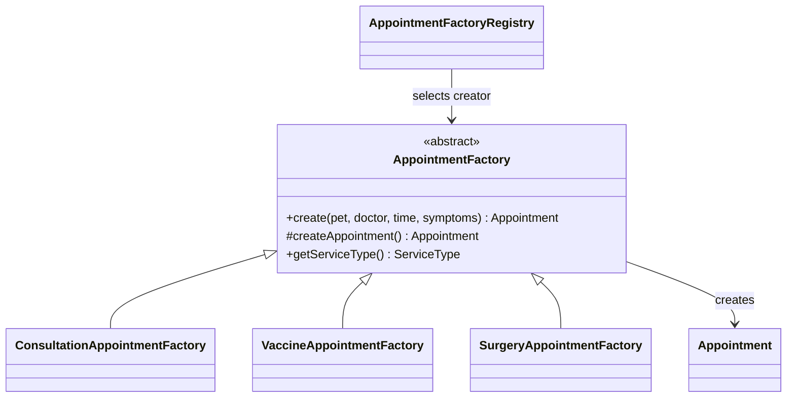

# Factory Method — Appointment (อ้น)

`AppointmentFactory` เป็น Creator และ `createAppointment()` เป็น Factory Method.
`ConsultationAppointmentFactory`, `VaccineAppointmentFactory`, `SurgeryAppointmentFactory`
เป็น Concrete Creators ที่สร้าง Appointment พร้อมคำแนะนำเตรียมตัวต่างกัน.
`create(...)` ประกอบข้อมูลร่วมและกำหนดสถานะ PENDING; `AppointmentFactoryRegistry`
เลือก creator จาก ServiceType ผ่าน Spring beans และตรวจว่าครบทุกประเภทโดยไม่ซ้ำ.

เก็บทุกประเภทในตาราง appointment เดียว โดยใช้ service_type แยกประเภท เพื่อให้ MedicalRecord
อ้างอิง appointment_id ได้โดยไม่ต้องรู้ชนิดบริการและไม่ต้องเพิ่มตารางย่อย.
Factory ไม่บันทึกฐานข้อมูล และไม่แทนการตรวจเจ้าของ ตารางเวร หรือคิวซ้ำใน Service.

## สถานะและการทดสอบ
เฉพาะงาน Appointment ของอ้น ไม่มีโมดูล Owner/Pet ของเพื่อนรวมใน branch
ใช้ AppointmentPet projection กับ PetOwner/Doctor ที่มีอยู่; หน้าลงทะเบียนรอทีมเชื่อมแยก

`mvn -f code/pom.xml clean test`: 69 tests ผ่านรวม Factory 13 tests
`pnpm --dir code/frontend-tests test`: 9 DOM tests ผ่าน
Factory tests ตรวจทุกประเภท ข้อมูลขาด/ผิด อาการว่าง/ยาวเกิน และ registry ไม่ครบ/ซ้ำ
ผลตรวจเฉพาะ branch นี้อยู่ใน testresult/appointment-final.md
