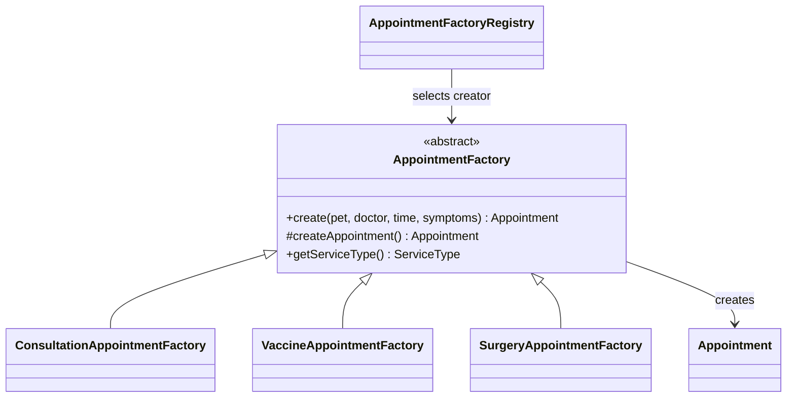

# Factory Method — Appointment (อ้น)

`AppointmentFactory` เป็น Creator และ `createAppointment()` เป็น Factory Method.
`ConsultationAppointmentFactory`, `VaccineAppointmentFactory`, `SurgeryAppointmentFactory`
เป็น Concrete Creators ที่สร้าง Appointment พร้อมคำแนะนำเตรียมตัวต่างกัน.
`create(...)` ประกอบข้อมูลร่วมและกำหนดสถานะ PENDING; `AppointmentFactoryRegistry`
เลือก creator จาก ServiceType ผ่าน Spring beans และตรวจว่าครบทุกประเภทโดยไม่ซ้ำ.

เก็บทุกประเภทในตาราง appointment เดียว โดยใช้ service_type แยกประเภท เพื่อให้ MedicalRecord
อ้างอิง appointment_id ได้โดยไม่ต้องรู้ชนิดบริการและไม่ต้องเพิ่มตารางย่อย.
Factory ไม่บันทึกฐานข้อมูล และไม่แทนการตรวจเจ้าของ ตารางเวร หรือคิวซ้ำใน Service.



## สถานะส่งงานรอบ 5 commits
เสร็จ: เอกสารข้อตกลง, domain, repositories, DTO validation, Factory Method และ tests ของ Factory.
ยังไม่ทำในรอบนี้ตามคำขอ: Service/Controller, กฎตารางเวร, Guest lookup, หน้าจอง/รายการ,
integration tests และ Sequence Diagrams. โค้ดนี้เป็นฐานสำหรับขั้นถัดไป ยังไม่มี API จองนัดที่ใช้งานได้.

ทดสอบเฉพาะ Factory และ Service ที่มีอยู่เดิมโดยไม่เชื่อม PostgreSQL:
```powershell
mvn -f code/pom.xml "-Dtest=AppointmentFactoryTest,DoctorServiceTest,ClinicConfigServiceTest" test
```
`PetclinicApplicationTests` เดิมต้องมี PostgreSQL ตาม application.properties จึงไม่ได้รวมในคำสั่งนี้.

ผลตรวจวันที่ 8 ตุลาคม 2026: คอมไพล์ Java release 17 บน JDK 26.0.2 และ Maven 3.9.16 ผ่าน.
ทดสอบรวม 26 กรณี ผ่านทั้งหมด (Factory 13, DoctorService 10, ClinicConfigService 3).
Factory tests ครอบคลุมทุกประเภทบริการ คำแนะนำเฉพาะประเภท การสร้าง object แยกกัน
ข้อมูลไม่ครบ อาการว่าง/ยาวเกิน และ factory registration ไม่ครบ/ซ้ำ.
ยังไม่ได้ตรวจ JPA queries/locking กับฐานข้อมูลจริง หรือ flow HTTP/UI เพราะอยู่นอกงาน 5 commits รอบนี้.
