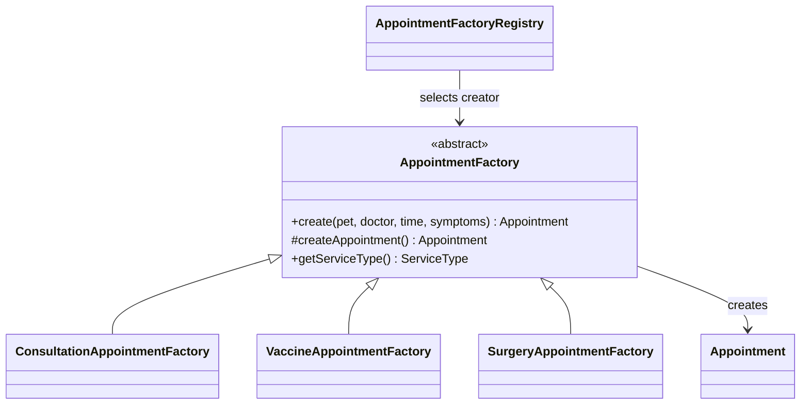

# Factory Method — Appointment (อ้น)

`AppointmentFactory` เป็น Creator และ `createAppointment()` เป็น Factory Method.
`ConsultationAppointmentFactory`, `VaccineAppointmentFactory`, `SurgeryAppointmentFactory`
เป็น Concrete Creators ที่สร้าง Appointment พร้อมคำแนะนำเตรียมตัวต่างกัน.
`create(...)` ประกอบข้อมูลร่วมและกำหนดสถานะ PENDING; `AppointmentFactoryRegistry`
เลือก creator จาก ServiceType ผ่าน Spring beans และตรวจว่าครบทุกประเภทโดยไม่ซ้ำ.

เก็บทุกประเภทในตาราง appointment เดียว โดยใช้ service_type แยกประเภท เพื่อให้ MedicalRecord
อ้างอิง appointment_id ได้โดยไม่ต้องรู้ชนิดบริการและไม่ต้องเพิ่มตารางย่อย.
Factory ไม่บันทึกฐานข้อมูล และไม่แทนการตรวจเจ้าของ ตารางเวร หรือคิวซ้ำใน Service.



## สถานะส่งงานฉบับสมบูรณ์
เสร็จ: เอกสารข้อตกลง, domain, repositories, DTO validation, Factory Method, กฎตารางเวร,
Service สร้าง/ค้นหา/แก้ไข/ยกเลิก, REST API, Guest lookup, หน้าจอง/รายการที่ใช้งานจริงและรองรับมือถือ,
tests และ Sequence Diagrams 3 scenarios. รวมโมดูลเจ้าของและสัตว์ของทีมแล้ว.
หน้า `/appointment-create.html` เปิดค้นเบอร์ → เลือกสัตว์ → จองจริง; `/appointments.html` ดู/เลื่อน/ยกเลิก.

ทดสอบทั้งหมดโดยใช้ H2 เฉพาะใน test scope ไม่ต้องเชื่อม PostgreSQL:
```powershell
mvn -f code/pom.xml test
```
`src/test/resources/application.properties` แยกฐานข้อมูลทดสอบออกจาก production.

ผลตรวจวันที่ 8 ตุลาคม 2026: คอมไพล์ Java release 17 บน JDK 26.0.2 และ Maven 3.9.16 ผ่าน.
ทดสอบรวม 26 กรณี ผ่านทั้งหมด (Factory 13, DoctorService 10, ClinicConfigService 3).
Factory tests ครอบคลุมทุกประเภทบริการ คำแนะนำเฉพาะประเภท การสร้าง object แยกกัน
ข้อมูลไม่ครบ อาการว่าง/ยาวเกิน และ factory registration ไม่ครบ/ซ้ำ.
รอบแรกยังไม่ได้ตรวจ JPA queries/locking; รอบ 11 commits เพิ่ม integration tests ตรวจ mappings,
queries, การเปลี่ยน version, การคืนคิว และ guest phone lookup กับ H2 แล้ว.
ผลตรวจรอบสุดท้าย 9 ตุลาคม 2026: Java 115 tests ผ่าน, frontend 8 tests ผ่าน.
HTTP tests บน PostgreSQL 18 ผ่านทั้งลงทะเบียน/CRUD/คืนคิว และการแข่งขัน 2 requests
กรณีหมอคนเดียวและสัตว์ตัวเดียว (201 หนึ่งคำขอ, 409 หนึ่งคำขอ).
ตรวจจอง/เลื่อน/ยกเลิกจากเบราว์เซอร์จริงผ่าน. ดูรายละเอียดใน `testresult/appointment-final.md`.
