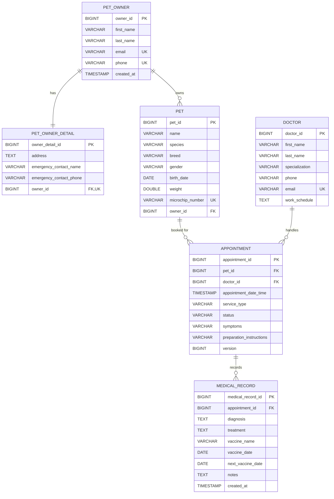

# Data Dictionary: ระบบ PawCare Pet Clinic & Vaccination

เอกสารนี้อธิบายโครงสร้างฐานข้อมูลทั้ง 6 ตารางของระบบ อ้างอิงจาก JPA Entity ใน `code/src/main/java/com/example/petclinic/domain/entity/` และตรวจเทียบกับ Schema จริงใน PostgreSQL ที่ Hibernate สร้าง (`spring.jpa.hibernate.ddl-auto=update`)

* **ฐานข้อมูล:** PostgreSQL (`petclinic_db`)
* **ชื่อตาราง / คอลัมน์:** snake_case ตามที่ประกาศใน `@Table` / `@Column`
* **Primary Key ทุกตาราง:** `BIGINT` สร้างอัตโนมัติ (`GENERATED BY DEFAULT AS IDENTITY` จาก `GenerationType.IDENTITY`)

---

## ภาพรวมตาราง

| ลำดับ | ตาราง | Entity | โมดูล | คำอธิบาย | ความสัมพันธ์ |
| --- | --- | --- | --- | --- | --- |
| 1 | `pet_owner` | `PetOwner` | Owner | ข้อมูลหลักของเจ้าของสัตว์เลี้ยง (ชื่อ, ติดต่อ) | 1-1 กับ `pet_owner_detail`, 1-N กับ `pet` |
| 2 | `pet_owner_detail` | `PetOwnerDetail` | Owner | ข้อมูลเพิ่มเติม (ที่อยู่, ผู้ติดต่อฉุกเฉิน) | 1-1 กับ `pet_owner` |
| 3 | `pet` | `Pet` | Pet | ข้อมูลสัตว์เลี้ยง | N-1 กับ `pet_owner`, 1-N กับ `appointment` |
| 4 | `doctor` | `Doctor` | Doctor | ข้อมูลสัตวแพทย์และตารางเวร | 1-N กับ `appointment` |
| 5 | `appointment` | `Appointment` | Appointment | การนัดหมายสัตว์เลี้ยงกับสัตวแพทย์ | N-1 กับ `pet` และ `doctor`, 1-N กับ `medical_record` |
| 6 | `medical_record` | `MedicalRecord` | Medical Record | ประวัติการรักษาและการฉีดวัคซีน | N-1 กับ `appointment` |

## ER Diagram

แผนภาพอื่น (Use Case, Class, Sequence, State) อยู่ในโฟลเดอร์ [`diagrams/`](diagrams/)

---

## 1. ตาราง `pet_owner` (Entity: `PetOwner`)

เก็บข้อมูลหลักของเจ้าของสัตว์เลี้ยง เบอร์โทรศัพท์ใช้ค้นหาแฟ้มของตัวเอง (ระบบไม่มีการสมัครบัญชีผู้ใช้)

| Field | Column | Data Type (Java / DB) | Key | Null | Unique | Constraints / Format | คำอธิบาย | ตัวอย่าง |
| --- | --- | --- | --- | --- | --- | --- | --- | --- |
| `ownerId` | `owner_id` | `Long` / `BIGINT` | PK | ไม่ได้ | Unique | Auto Increment (`IDENTITY`) | รหัสเจ้าของสัตว์เลี้ยง | `1` |
| `firstName` | `first_name` | `String` / `VARCHAR(50)` | | ไม่ได้ | | Max 50, ห้ามว่าง | ชื่อจริง | `พิชยา` |
| `lastName` | `last_name` | `String` / `VARCHAR(50)` | | ไม่ได้ | | Max 50, ห้ามว่าง | นามสกุล | `สิทธิพันธ์` |
| `email` | `email` | `String` / `VARCHAR(100)` | | ไม่ได้ | Unique | Max 100, รูปแบบอีเมล | อีเมล (ห้ามซ้ำ) | `pitchaya@example.com` |
| `phone` | `phone` | `String` / `VARCHAR(20)` | | ไม่ได้ | Unique | `^0[0-9]{8,9}$` | เบอร์โทรศัพท์ ใช้ค้นหาแฟ้ม (ห้ามซ้ำ) | `0811111119` |
| `createdAt` | `created_at` | `LocalDateTime` / `TIMESTAMP(6)` | | ได้ | | สร้างอัตโนมัติ (`@PrePersist`), แก้ไขไม่ได้ (`updatable = false`) | วันเวลาที่ลงทะเบียน | `2026-10-07 16:14:41` |
| `petOwnerDetail` | ไม่มีคอลัมน์ | `PetOwnerDetail` | | | | `@OneToOne(mappedBy = "petOwner", cascade = ALL, fetch = LAZY)` | ฝั่งที่ไม่ได้ถือ FK ของความสัมพันธ์ 1-1 | |

**กฎการตรวจสอบ (`PetOwnerRequestDTO` + `PetOwnerServiceImpl`)**

| กฎ | เมื่อไม่ผ่าน | HTTP Status |
| --- | --- | --- |
| `firstName`, `lastName` ห้ามว่าง ไม่เกิน 50 ตัวอักษร | กรุณากรอกชื่อจริงของคุณ / กรุณากรอกนามสกุล | 400 |
| `email` ห้ามว่าง รูปแบบอีเมล ไม่เกิน 100 ตัวอักษร | กรุณากรอกอีเมล / รูปแบบอีเมลไม่ถูกต้อง | 400 |
| `phone` ห้ามว่าง ขึ้นต้นด้วย 0 ยาว 9-10 หลัก | เบอร์โทรศัพท์ที่กรอกต้องขึ้นต้นด้วย 0 และ ไม่เกิน 10 หลัก | 400 |
| อีเมลห้ามซ้ำ (ตอนเพิ่ม และตอนแก้ไขเป็นอีเมลใหม่) | อีเมลนี้ถูกใช้งานในระบบแล้ว | 409 |
| เบอร์โทรศัพท์ห้ามซ้ำ (ตอนเพิ่ม และตอนแก้ไขเป็นเบอร์ใหม่) | เบอร์โทรศัพท์นี้มีในระบบแล้ว | 409 |
| ลบเจ้าของที่ยังมีสัตว์เลี้ยงอยู่ | ไม่สามารถลบเจ้าของที่ยังมีสัตว์เลี้ยงในระบบได้ | 409 |
| ค้นหา / แก้ไข / ลบ Id ที่ไม่มีอยู่จริง | ไม่พบข้อมูลเจ้าของสัตว์เลี้ยงรหัส ... | 404 |

---

## 2. ตาราง `pet_owner_detail` (Entity: `PetOwnerDetail`)

แยกข้อมูลส่วนตัวที่ไม่ได้ใช้บ่อยออกจาก `pet_owner` เจ้าของ 1 คนมีรายละเอียดได้ 1 แถว (บังคับด้วย Unique บน `owner_id`)

| Field | Column | Data Type (Java / DB) | Key | Null | Unique | Constraints / Format | คำอธิบาย | ตัวอย่าง |
| --- | --- | --- | --- | --- | --- | --- | --- | --- |
| `ownerDetailId` | `owner_detail_id` | `Long` / `BIGINT` | PK | ไม่ได้ | Unique | Auto Increment (`IDENTITY`) | รหัสรายละเอียดเจ้าของ | `1` |
| `address` | `address` | `String` / `TEXT` | | ได้ | | ไม่จำกัดความยาว | ที่อยู่ | `ขอนแก่น` |
| `emergencyContactName` | `emergency_contact_name` | `String` / `VARCHAR(50)` | | ได้ | | Max 50 | ชื่อผู้ติดต่อฉุกเฉิน | `สมศรี สิทธิพันธ์` |
| `emergencyContactPhone` | `emergency_contact_phone` | `String` / `VARCHAR(20)` | | ได้ (DB) / บังคับกรอก (API) | | `^0[0-9]{8,9}$` | เบอร์โทรศัพท์ฉุกเฉิน | `0987654321` |
| `petOwner` | `owner_id` | `PetOwner` / `BIGINT` | FK → `pet_owner.owner_id` | ไม่ได้ | Unique | `@OneToOne(fetch = LAZY)`, `@JoinColumn(nullable = false, unique = true)` | เจ้าของของรายละเอียดนี้ | `1` |

**กฎการตรวจสอบ:** `emergencyContactName` ไม่เกิน 50 ตัวอักษร (ไม่บังคับกรอก) · `emergencyContactPhone` บังคับกรอกและรูปแบบเดียวกับ `phone` · บันทึกพร้อม `pet_owner` ในคำขอเดียว (`cascade = ALL`)

---

## 3. ตาราง `pet` (Entity: `Pet`)

เก็บข้อมูลสัตว์เลี้ยง สัตว์ 1 ตัวมีเจ้าของ 1 คน และเจ้าของ 1 คนมีสัตว์ได้หลายตัว

| Field | Column | Data Type (Java / DB) | Key | Null | Unique | Constraints / Format | คำอธิบาย | ตัวอย่าง |
| --- | --- | --- | --- | --- | --- | --- | --- | --- |
| `petId` | `pet_id` | `Long` / `BIGINT` | PK | ไม่ได้ | Unique | Auto Increment (`IDENTITY`) | รหัสสัตว์เลี้ยง | `1` |
| `name` | `name` | `String` / `VARCHAR(100)` | | ไม่ได้ | | Max 100, ห้ามว่าง | ชื่อสัตว์เลี้ยง | `โมจิ` |
| `species` | `species` | `String` / `VARCHAR(50)` | | ไม่ได้ | | Max 50, ห้ามว่าง, หน้าเว็บให้เลือก `Dog` / `Cat` / `Other` | ประเภทสัตว์ (เก็บภาษาอังกฤษ แสดงผลภาษาไทย) | `Dog` |
| `breed` | `breed` | `String` / `VARCHAR(100)` | | ได้ | | Max 100 | สายพันธุ์ | `ชิบะ อินุ` |
| `gender` | `gender` | `String` / `VARCHAR(20)` | | ได้ | | Max 20, หน้าเว็บให้เลือก `Male` / `Female` | เพศ | `Male` |
| `birthDate` | `birth_date` | `LocalDate` / `DATE` | | ได้ | | รูปแบบ `YYYY-MM-DD` | วันเกิด | `2023-04-12` |
| `weight` | `weight` | `Double` / `DOUBLE PRECISION` | | ได้ | | ต้องมากกว่า 0 (`@Positive`) หน่วยกิโลกรัม | น้ำหนัก (กก.) | `8.5` |
| `microchipNumber` | `microchip_number` | `String` / `VARCHAR(100)` | | ได้ | Unique | Max 100 | หมายเลขไมโครชิป (ถ้ามี ห้ามซ้ำ) | `MC-0001` |
| `petOwner` | `owner_id` | `PetOwner` / `BIGINT` | FK → `pet_owner.owner_id` | ไม่ได้ | | `@ManyToOne(fetch = LAZY)` | เจ้าของสัตว์เลี้ยง | `1` |

**กฎการตรวจสอบ (`PetRequestDTO` + `PetServiceImpl`)**

| กฎ | เมื่อไม่ผ่าน | HTTP Status |
| --- | --- | --- |
| `name`, `species` ห้ามว่าง และไม่เกินความยาวที่กำหนด | กรุณาระบุชื่อสัตว์เลี้ยง / กรุณาระบุประเภทสัตว์ | 400 |
| `weight` ต้องมากกว่า 0 | น้ำหนักต้องมากกว่า 0 | 400 |
| `ownerId` ห้ามว่าง ต้องมากกว่า 0 และต้องมีเจ้าของอยู่จริง | กรุณาระบุรหัสเจ้าของสัตว์เลี้ยง / ไม่พบเจ้าของสัตว์เลี้ยงรหัส ... | 400 / 404 |
| หมายเลขไมโครชิปห้ามซ้ำ | ข้อมูลขัดแย้งกับข้อมูลที่มีอยู่ในระบบ | 409 |
| แก้ไขข้อมูลสัตว์ไม่เปลี่ยนเจ้าของเดิม | (ระบบคงเจ้าของเดิมไว้) | |
| ค้นหา / แก้ไข / ลบ Id ที่ไม่มีอยู่จริง | ไม่พบสัตว์เลี้ยงรหัส ... | 404 |
| เจ้าของดู / แก้ไข / ลบได้เฉพาะสัตว์ของตัวเอง | ดูหรือแก้ไขได้เฉพาะข้อมูลของตัวเอง | 403 |

---

## 4. ตาราง `doctor` (Entity: `Doctor`)

เก็บข้อมูลสัตวแพทย์ ความเชี่ยวชาญ และตารางเวร ข้อมูลตัวอย่างอยู่ใน `code/src/main/resources/data-doctor.sql`

| Field | Column | Data Type (Java / DB) | Key | Null | Unique | Constraints / Format | คำอธิบาย | ตัวอย่าง |
| --- | --- | --- | --- | --- | --- | --- | --- | --- |
| `doctorId` | `doctor_id` | `Long` / `BIGINT` | PK | ไม่ได้ | Unique | Auto Increment (`IDENTITY`) | รหัสสัตวแพทย์ | `1` |
| `firstName` | `first_name` | `String` / `VARCHAR(100)` | | ไม่ได้ | | Max 100, ห้ามว่าง | ชื่อ | `นันทิดา` |
| `lastName` | `last_name` | `String` / `VARCHAR(100)` | | ไม่ได้ | | Max 100, ห้ามว่าง | นามสกุล | `รักษ์สัตว์` |
| `specialization` | `specialization` | `String` / `VARCHAR(100)` | | ได้ | | Max 100, คั่นหลายความเชี่ยวชาญด้วย `,` | ความเชี่ยวชาญ | `อายุรกรรมทั่วไป, โรคผิวหนัง` |
| `phone` | `phone` | `String` / `VARCHAR(20)` | | ไม่ได้ | | `^0[0-9]{8,9}$` (ตัดขีดและช่องว่างออกก่อนตรวจ) | เบอร์โทรศัพท์ | `0811112233` |
| `email` | `email` | `String` / `VARCHAR(255)` | | ไม่ได้ | Unique | Max 255, รูปแบบอีเมล | อีเมล (ห้ามซ้ำ) | `nantida.r@vetclinic.com` |
| `workSchedule` | `work_schedule` | `String` / `TEXT` | | ได้ | | รูปแบบแนะนำ `วันเริ่ม - วันสุดท้าย: เวลา (ห้อง)` | ตารางเวร ใช้คำนวณวันออกตรวจในหน้า Veterinarians | `จันทร์ - ศุกร์: 09:00 - 17:00 น. (ห้องตรวจ 1)` |

**กฎการตรวจสอบ (`DoctorRequestDTO` + `DoctorServiceImpl`)**

| กฎ | เมื่อไม่ผ่าน | HTTP Status |
| --- | --- | --- |
| `firstName`, `lastName`, `phone`, `email` ห้ามว่าง และรูปแบบถูกต้อง | กรุณากรอกชื่อสัตวแพทย์ / เบอร์โทรศัพท์ต้องขึ้นต้นด้วย 0 และมีความยาว 9-10 หลัก | 400 |
| อีเมลห้ามซ้ำ (ตอนเพิ่ม และตอนแก้ไขเป็นอีเมลของคนอื่น) | อีเมลนี้มีอยู่ในระบบแล้ว | 409 |
| ลบสัตวแพทย์ที่ยังมีนัดหมายอ้างถึง | ไม่สามารถลบสัตวแพทย์ที่ยังมีนัดหมายในระบบได้ | 409 |
| เพิ่ม / แก้ไข / ลบ ทำได้เฉพาะเจ้าหน้าที่ | รายการนี้ทำได้เฉพาะเจ้าหน้าที่ | 403 |
| ค้นหา / แก้ไข / ลบ Id ที่ไม่มีอยู่จริง | ไม่พบข้อมูลสัตวแพทย์ที่มีรหัส ... | 404 |

---

## 5. ตาราง `appointment` (Entity: `Appointment`)

เก็บนัดหมายของสัตว์เลี้ยงกับสัตวแพทย์ ไม่มีคอลัมน์ `owner_id` โดยตรง (อ่านเจ้าของผ่าน `appointment.pet_id → pet.owner_id`) รายละเอียดเพิ่มเติมของโมดูลอยู่ใน [`appointment-data-dictionary.md`](appointment-data-dictionary.md)

| Field | Column | Data Type (Java / DB) | Key | Null | Unique | Constraints / Format | คำอธิบาย | ตัวอย่าง |
| --- | --- | --- | --- | --- | --- | --- | --- | --- |
| `appointmentId` | `appointment_id` | `Long` / `BIGINT` | PK | ไม่ได้ | Unique | Auto Increment (`IDENTITY`) | รหัสนัดหมาย | `1` |
| `pet` | `pet_id` | `Pet` / `BIGINT` | FK → `pet.pet_id` | ไม่ได้ | | `@ManyToOne(fetch = LAZY, optional = false)` | สัตว์ที่รับบริการ (ไม่เปลี่ยนตอนเลื่อนนัด) | `1` |
| `doctor` | `doctor_id` | `Doctor` / `BIGINT` | FK → `doctor.doctor_id` | ไม่ได้ | | `@ManyToOne(fetch = LAZY, optional = false)` | สัตวแพทย์ผู้รับนัด | `2` |
| `appointmentDateTime` | `appointment_date_time` | `LocalDateTime` / `TIMESTAMP(6)` | | ไม่ได้ | | อนาคต, นาที 00 หรือ 30, อยู่ในเวลาคลินิกและเวรหมอ (เวลา `Asia/Bangkok`) | วันเวลาเริ่มนัด (ช่องละ 30 นาที) | `2026-10-20 10:00:00` |
| `serviceType` | `service_type` | `ServiceType` / `VARCHAR(20)` | | ไม่ได้ | | CHECK: `CONSULTATION`, `VACCINE`, `SURGERY` | ประเภทบริการ | `VACCINE` |
| `status` | `status` | `AppointmentStatus` / `VARCHAR(20)` | | ไม่ได้ | | CHECK: `PENDING`, `CONFIRMED`, `COMPLETED`, `CANCELLED` (นัดใหม่ = `PENDING`) | สถานะนัดหมาย | `PENDING` |
| `symptoms` | `symptoms` | `String` / `VARCHAR(1000)` | | ได้ (DB) / บังคับกรอก (API) | | Max 1000 | อาการเบื้องต้น / เหตุผลที่มา | `ซึม ไม่ทานอาหาร 2 วัน` |
| `preparationInstructions` | `preparation_instructions` | `String` / `VARCHAR(500)` | | ได้ | | สร้างโดย Factory ตามประเภทบริการ ผู้ใช้กำหนดเองไม่ได้ | คำแนะนำการเตรียมตัว | `งดอาหาร 8 ชั่วโมงก่อนผ่าตัด` |
| `version` | `version` | `Long` / `BIGINT` | | ไม่ได้ | | `@Version` (Optimistic Locking) เริ่มที่ 0 | เลขรุ่นข้อมูล กันการแก้ไขทับกัน | `0` |

**ค่าที่อนุญาต**

| `service_type` | ความหมาย | | `status` | ความหมาย |
| --- | --- | --- | --- | --- |
| `CONSULTATION` | ตรวจรักษาทั่วไป | | `PENDING` | รอยืนยันนัด |
| `VACCINE` | ฉีดวัคซีน | | `CONFIRMED` | เจ้าหน้าที่ยืนยันแล้ว |
| `SURGERY` | ผ่าตัด | | `COMPLETED` | ตรวจเสร็จแล้ว (บันทึกประวัติการรักษาได้) |
| | | | `CANCELLED` | ยกเลิกนัด |

**กฎการตรวจสอบ (`AppointmentRequestDTO`, `AppointmentUpdateDTO` + `AppointmentServiceImpl`)**

| กฎ | HTTP Status |
| --- | --- |
| `petId`, `doctorId`, `appointmentDateTime`, `serviceType`, `symptoms` ห้ามว่าง และรหัสต้องมากกว่า 0 | 400 |
| เวลานัดต้องอยู่ในอนาคต ตรงช่อง 30 นาที และอยู่ในเวลาคลินิกและเวรของหมอ | 400 |
| หมอเดียวกันหรือสัตว์เดียวกันมีนัด `PENDING` / `CONFIRMED` เวลาเดียวกันแล้ว | 409 |
| แก้ไขด้วย `version` ที่ไม่ใช่ล่าสุด | 409 |
| เปลี่ยนสถานะผิดลำดับ (ต้อง `PENDING → CONFIRMED → COMPLETED`) | 409 |
| ปิดนัด (`COMPLETED`) ก่อนถึงเวลานัด | 409 |
| เลื่อนหรือยกเลิกนัดที่ `COMPLETED` / `CANCELLED` แล้ว | 409 |
| เจ้าของจัดการได้เฉพาะนัดของสัตว์ตัวเอง, เปลี่ยนสถานะได้เฉพาะเจ้าหน้าที่ | 403 |

---

## 6. ตาราง `medical_record` (Entity: `MedicalRecord`)

เก็บประวัติการรักษาและการฉีดวัคซีนของนัดหมายที่ตรวจเสร็จแล้ว นัด 1 ครั้งมีประวัติได้หลายรายการ (One-to-Many จาก Appointment)

| Field | Column | Data Type (Java / DB) | Key | Null | Unique | Constraints / Format | คำอธิบาย | ตัวอย่าง |
| --- | --- | --- | --- | --- | --- | --- | --- | --- |
| `medicalRecordId` | `medical_record_id` | `Long` / `BIGINT` | PK | ไม่ได้ | Unique | Auto Increment (`IDENTITY`) | รหัสประวัติการรักษา | `1` |
| `appointmentId` | `appointment_id` | `Long` / `BIGINT` | FK → `appointment.appointment_id` (`fk_medical_record_appointment`) | ไม่ได้ | | นัดต้องมีอยู่จริงและสถานะ `COMPLETED` | นัดหมายที่เป็นที่มาของประวัตินี้ | `1` |
| `diagnosis` | `diagnosis` | `String` / `TEXT` | | ได้ | | Max 2000 (API) | ผลการวินิจฉัย | `ผิวหนังอักเสบจากเชื้อรา` |
| `treatment` | `treatment` | `String` / `TEXT` | | ได้ | | Max 2000 (API) | การรักษาและยาที่ให้ | `ยาทาต้านเชื้อรา วันละ 2 ครั้ง` |
| `vaccineName` | `vaccine_name` | `String` / `VARCHAR(150)` | | ได้ | | Max 150 (ตรงกับความยาวคอลัมน์) | ชื่อวัคซีนที่ฉีด | `วัคซีนรวม 5 โรค` |
| `vaccineDate` | `vaccine_date` | `LocalDate` / `DATE` | | ได้ | | รูปแบบ `YYYY-MM-DD` | วันที่ฉีดวัคซีน | `2026-10-01` |
| `nextVaccineDate` | `next_vaccine_date` | `LocalDate` / `DATE` | | ได้ | | รูปแบบ `YYYY-MM-DD` | วันนัดฉีดวัคซีนครั้งถัดไป | `2027-10-01` |
| `notes` | `notes` | `String` / `TEXT` | | ได้ | | Max 2000 (API) | หมายเหตุของสัตวแพทย์ | `นัดติดตามอาการ 2 สัปดาห์` |
| `createdAt` | `created_at` | `LocalDateTime` / `TIMESTAMP(6)` | | ได้ | | สร้างอัตโนมัติ (`@PrePersist`), แก้ไขไม่ได้ | วันเวลาที่บันทึก | `2026-10-01 11:20:00` |
| `appointment` | `appointment_id` (ใช้คอลัมน์เดียวกัน) | `Appointment` | | | | `@ManyToOne(fetch = LAZY)`, `insertable = false, updatable = false` | ความสัมพันธ์ไปยังนัดหมาย สำหรับสร้าง FK | |

**กฎการตรวจสอบ (`MedicalRecordRequestDTO` + `MedicalRecordServiceImpl`)**

| กฎ | เมื่อไม่ผ่าน | HTTP Status |
| --- | --- | --- |
| `appointmentId` ห้ามว่าง และต้องมากกว่า 0 | กรุณาระบุรหัสการนัดหมาย | 400 |
| นัดหมายต้องมีอยู่จริง | ไม่พบนัดหมายสำหรับบันทึกประวัติการรักษา | 404 |
| ดู / แก้ไข / ลบ Id ที่ไม่มีอยู่จริง | ไม่พบประวัติการรักษาที่มีรหัส ... | 404 |
| นัดหมายต้องมีสถานะ `COMPLETED` ทั้งตอนบันทึกและแก้ไข | บันทึกประวัติการรักษาได้เฉพาะนัดที่เสร็จสิ้นแล้ว (COMPLETED) | 409 |
| ดู / เพิ่ม / แก้ไข / ลบ ทำได้เฉพาะเจ้าหน้าที่ | รายการนี้ทำได้เฉพาะเจ้าหน้าที่ | 403 |

---

## 7. ความสัมพันธ์ (Relationships)

| ความสัมพันธ์ | ประเภท | ฝั่งที่ถือ FK | JPA Mapping | กฎ |
| --- | --- | --- | --- | --- |
| `pet_owner` — `pet_owner_detail` | One-to-One | `pet_owner_detail.owner_id` (Unique) | `@OneToOne(mappedBy)` / `@OneToOne @JoinColumn` | บันทึกและลบพร้อมกัน (`cascade = ALL`) |
| `pet_owner` — `pet` | One-to-Many | `pet.owner_id` | `@ManyToOne` ใน `Pet` | ลบเจ้าของที่ยังมีสัตว์ไม่ได้ (409) |
| `pet` — `appointment` | One-to-Many | `appointment.pet_id` | `@ManyToOne(optional = false)` | ยกเลิกนัดด้วยการเปลี่ยนสถานะ ไม่ลบแถว |
| `doctor` — `appointment` | One-to-Many | `appointment.doctor_id` | `@ManyToOne(optional = false)` | ลบสัตวแพทย์ที่ยังมีนัดไม่ได้ (409) |
| `appointment` — `medical_record` | One-to-Many | `medical_record.appointment_id` | `@ManyToOne` (FK `fk_medical_record_appointment`) | บันทึกได้เฉพาะนัด `COMPLETED` |

ทุก FK ไม่กำหนด `ON DELETE CASCADE` เพื่อป้องกันการลบข้อมูลที่ยังอ้างอิงกันโดยไม่ตั้งใจ

---

## 8. Index และ Constraint

| ชื่อ | ตาราง | คอลัมน์ | ประเภท | เหตุผล |
| --- | --- | --- | --- | --- |
| `pet_owner_pkey` | `pet_owner` | `owner_id` | Primary Key | ค้นหาตาม Id |
| Unique `email` | `pet_owner` | `email` | Unique | ห้ามอีเมลซ้ำ และ `existsByEmail` ค้นได้เร็ว |
| Unique `phone` | `pet_owner` | `phone` | Unique | ห้ามเบอร์ซ้ำ และค้นหาแฟ้มด้วยเบอร์ได้เร็ว |
| `pet_owner_detail_pkey` | `pet_owner_detail` | `owner_detail_id` | Primary Key | ระบุแถวรายละเอียด |
| Unique `owner_id` | `pet_owner_detail` | `owner_id` | Unique + FK | บังคับความสัมพันธ์ 1-1 |
| `pet_pkey` | `pet` | `pet_id` | Primary Key | ค้นหาตาม Id |
| `idx_pet_owner_id` | `pet` | `owner_id` | Index + FK | ดึงสัตว์ทั้งหมดของเจ้าของ (แฟ้มเจ้าของ, My Pets) |
| Unique `microchip_number` | `pet` | `microchip_number` | Unique | ห้ามไมโครชิปซ้ำ |
| `doctor_pkey` | `doctor` | `doctor_id` | Primary Key | ค้นหาตาม Id |
| Unique `email` | `doctor` | `email` | Unique | ห้ามอีเมลสัตวแพทย์ซ้ำ |
| `appointment_pkey` | `appointment` | `appointment_id` | Primary Key | ค้นหาตาม Id |
| `idx_appointment_doctor_time` | `appointment` | `doctor_id, appointment_date_time` | Composite Index | ตรวจคิวว่างของหมอ |
| `idx_appointment_pet_time` | `appointment` | `pet_id, appointment_date_time` | Composite Index | ตรวจนัดซ้ำของสัตว์ |
| `appointment_service_type_check` | `appointment` | `service_type` | CHECK | รับเฉพาะค่าใน `ServiceType` |
| `appointment_status_check` | `appointment` | `status` | CHECK | รับเฉพาะค่าใน `AppointmentStatus` |
| `medical_record_pkey` | `medical_record` | `medical_record_id` | Primary Key | ค้นหาตาม Id |
| `fk_medical_record_appointment` | `medical_record` | `appointment_id` | Foreign Key | ประวัติต้องผูกกับนัดที่มีอยู่จริง |

---

## 9. ตัวอย่างข้อมูล

**`pet_owner`**

| owner_id | first_name | last_name | email | phone | created_at |
| --- | --- | --- | --- | --- | --- |
| 1 | พิชยา | สิทธิพันธ์ | pitchaya@example.com | 0811111119 | 2026-10-07 16:14:41 |

**`pet_owner_detail`**

| owner_detail_id | address | emergency_contact_name | emergency_contact_phone | owner_id |
| --- | --- | --- | --- | --- |
| 1 | ขอนแก่น | สมศรี สิทธิพันธ์ | 0987654321 | 1 |

**`pet`**

| pet_id | name | species | breed | gender | birth_date | weight | microchip_number | owner_id |
| --- | --- | --- | --- | --- | --- | --- | --- | --- |
| 1 | โมจิ | Dog | ชิบะ อินุ | Male | 2023-04-12 | 8.5 | MC-0001 | 1 |
| 2 | ส้มโอ | Cat | เปอร์เซีย | Female | 2022-01-20 | 4.2 | | 1 |

**`doctor`**

| doctor_id | first_name | last_name | specialization | phone | email | work_schedule |
| --- | --- | --- | --- | --- | --- | --- |
| 1 | นันทิดา | รักษ์สัตว์ | อายุรกรรมทั่วไป, โรคผิวหนัง | 0811112233 | nantida.r@vetclinic.com | จันทร์ - ศุกร์: 09:00 - 17:00 น. (ห้องตรวจ 1) |
| 2 | กิตติศักดิ์ | เจริญกิจ | ศัลยกรรม, กระดูกและข้อ | 0822223344 | kittisak.k@vetclinic.com | อังคาร - เสาร์: 10:00 - 19:00 น. (ห้องผ่าตัด) |

**`appointment`**

| appointment_id | pet_id | doctor_id | appointment_date_time | service_type | status | symptoms | version |
| --- | --- | --- | --- | --- | --- | --- | --- |
| 1 | 1 | 1 | 2026-10-01 10:00:00 | VACCINE | COMPLETED | ฉีดวัคซีนประจำปี | 2 |
| 2 | 2 | 1 | 2026-10-20 10:00:00 | CONSULTATION | PENDING | ซึม ไม่ทานอาหาร 2 วัน | 0 |

**`medical_record`**

| medical_record_id | appointment_id | diagnosis | treatment | vaccine_name | vaccine_date | next_vaccine_date | notes |
| --- | --- | --- | --- | --- | --- | --- | --- |
| 1 | 1 | สุขภาพแข็งแรง | ฉีดวัคซีนประจำปี | วัคซีนรวม 5 โรค | 2026-10-01 | 2027-10-01 | นัดฉีดครั้งถัดไปอีก 1 ปี |

---

## 10. รหัสสถานะที่ API ตอบกลับเมื่อข้อมูลไม่ถูกต้อง

ทุกโมดูลส่งข้อผิดพลาดผ่าน `GlobalExceptionHandler` ในรูปแบบเดียวกัน (`timestamp`, `status`, `error`, `message`, `path` และ `errors` รายช่องเมื่อ Validation ไม่ผ่าน)

| HTTP Status | Exception | เมื่อไหร่ |
| --- | --- | --- |
| 400 Bad Request | `MethodArgumentNotValidException`, `IllegalArgumentException` | ข้อมูลไม่ผ่าน Validation หรือค่าไม่ถูกต้อง |
| 403 Forbidden | `ForbiddenException` | ไม่ใช่เจ้าหน้าที่ หรือไม่ใช่เจ้าของแฟ้ม |
| 404 Not Found | `ResourceNotFoundException` | ไม่พบข้อมูลตาม Id |
| 409 Conflict | `DuplicateResourceException`, `DataIntegrityViolationException` | ข้อมูลซ้ำ ลบข้อมูลที่ยังถูกอ้างอิง หรือสถานะไม่ถูกต้อง |
