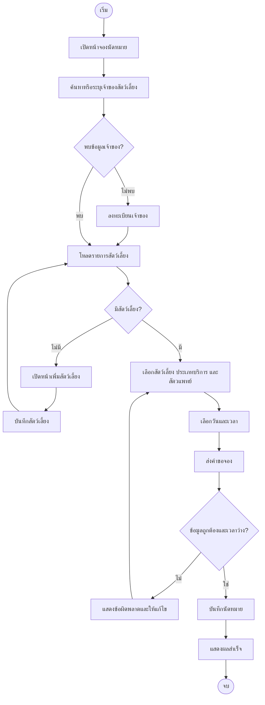

# Activity Diagram — ขั้นตอนจองนัดหมาย

แสดงเส้นทางผู้ใช้ทั่วไป รวมการเพิ่มสัตว์เลี้ยงก่อนจอง โดยอิงหน้า Booking และ Guest Appointment API.

หมายเหตุ: ขั้นตอนตรวจสอบช่วงเวลาที่ว่างเป็นความรับผิดชอบของ Service/Policy ไม่ใช่แค่การตรวจในหน้าเว็บ.
