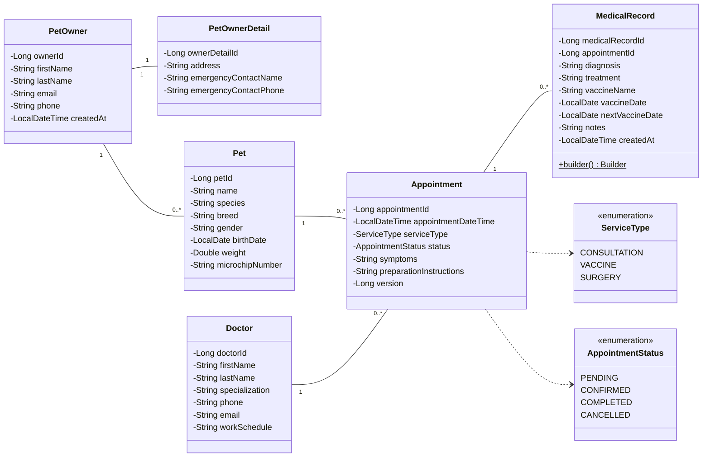
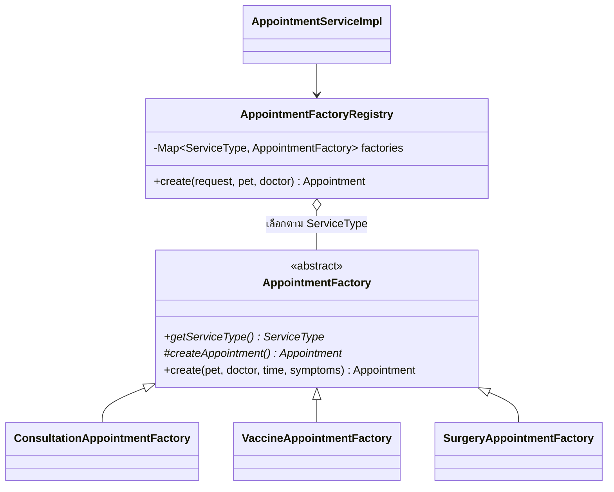
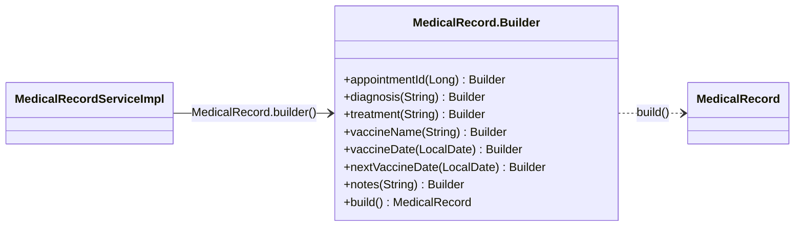
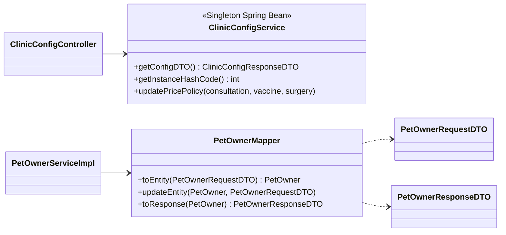

# Class Diagram

## 1. Domain (Entity และ Enum)

## 2. คลาสที่ใช้ Design Pattern

### 2.1 Factory Method (สร้างนัดหมายตามประเภทบริการ)

### 2.2 Builder (ประกอบประวัติการรักษา)

### 2.3 Singleton (ค่ากำหนดคลินิก) และ 2.4 DTO + Mapper (เจ้าของสัตว์เลี้ยง)

| Pattern | คลาสหลัก | หน้าที่ |
| --- | --- | --- |
| Factory Method | `AppointmentFactory` + Factory 3 ประเภท, `AppointmentFactoryRegistry` | สร้างนัดหมายพร้อมคำแนะนำการเตรียมตัวตามประเภทบริการ |
| Builder | `MedicalRecord.Builder` | ประกอบประวัติการรักษาที่มีหลายฟิลด์ไม่บังคับ |
| Singleton | `ClinicConfigService` | ข้อมูลคลินิกและอัตราค่าบริการมี Instance เดียว (`GET /api/v1/config/singleton-check`) |
| DTO + Mapper | `PetOwnerRequestDTO`, `PetOwnerResponseDTO`, `PetOwnerMapper` | แยก Entity ออกจากข้อมูลที่รับ-ส่งผ่าน API |
