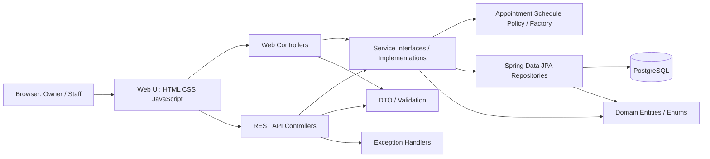

# Component Diagram — PawCare

แสดงส่วนประกอบระดับซอฟต์แวร์ที่อ้างอิงโครงสร้าง Spring Boot ใน `code/src/main/java/com/example/petclinic`.

ข้อควรอธิบาย: Controllers จัดการ HTTP, Services ดูแลกฎธุรกิจ, Repositories ติดต่อฐานข้อมูล, Entities แทนข้อมูลหลัก และ DTO ใช้รับส่งข้อมูล API.
