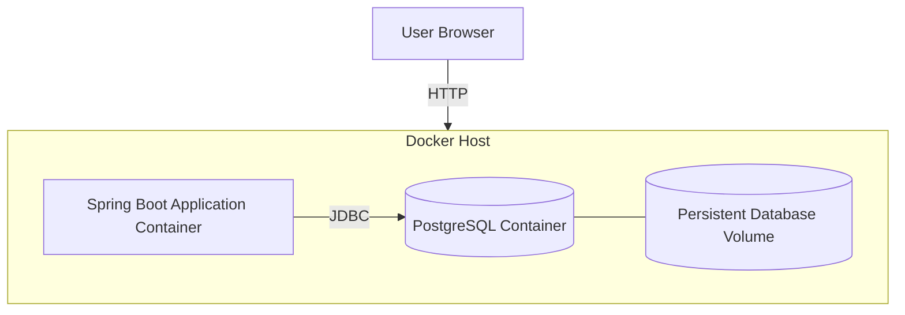

# Deployment Diagram — PawCare (Docker Compose)

แผนภาพนี้อธิบายการรันด้วย Docker Compose ในเครื่องหรือเซิร์ฟเวอร์ที่ติดตั้ง Docker **ไม่ใช่หลักฐานว่า Deploy สาธารณะแล้ว**.

อ้างอิง `code/Dockerfile` และ `docker-compose.yml`. พอร์ต, environment variables และชื่อ volume ที่แน่นอนให้ตรวจในไฟล์ Compose ของโปรเจกต์ก่อนนำไปใช้ในเซิร์ฟเวอร์จริง.
