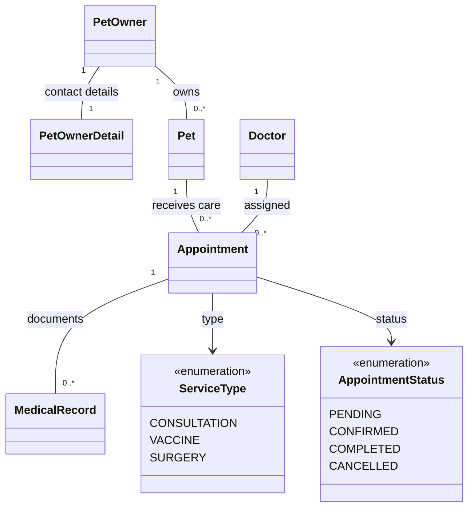

# Domain Model — PawCare

แสดงแนวคิดหลักของธุรกิจ (ไม่ใช่คลาสของ Controller/Service) โดยอิง Entity ใน `code/src/main/java/com/example/petclinic/domain/entity/`.

การตีความ: เจ้าของสัตว์เลี้ยงลงทะเบียนข้อมูลและสัตว์เลี้ยงของตน จากนั้นจองนัดกับสัตวแพทย์ได้ โดยนัดหมายมีประเภทบริการและสถานะ ส่วนประวัติการรักษาผูกกับนัดหมาย ตรวจสอบข้อกำหนดของความสัมพันธ์กับ ER Diagram และ Entity อีกครั้งก่อนนำเสนอ.
