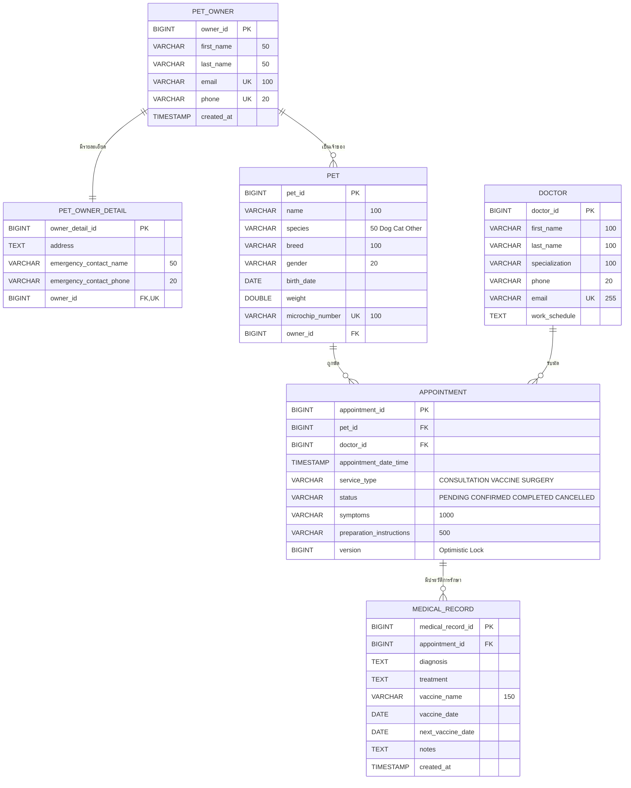

# ER Diagram

ฐานข้อมูล PostgreSQL 6 ตาราง (Hibernate สร้างจาก JPA Entity ด้วย `ddl-auto=update`)

| ความสัมพันธ์ | ประเภท | Foreign Key | กฎ |
| --- | --- | --- | --- |
| `pet_owner` — `pet_owner_detail` | 1 : 1 | `pet_owner_detail.owner_id` (Unique) | บันทึกและลบพร้อมกัน |
| `pet_owner` — `pet` | 1 : N | `pet.owner_id` | ลบเจ้าของที่ยังมีสัตว์ไม่ได้ |
| `pet` — `appointment` | 1 : N | `appointment.pet_id` | ยกเลิกนัดด้วยการเปลี่ยนสถานะ ไม่ลบแถว |
| `doctor` — `appointment` | 1 : N | `appointment.doctor_id` | ลบสัตวแพทย์ที่ยังมีนัดไม่ได้ |
| `appointment` — `medical_record` | 1 : N | `medical_record.appointment_id` (`fk_medical_record_appointment`) | บันทึกได้เฉพาะนัดที่ `COMPLETED` |
