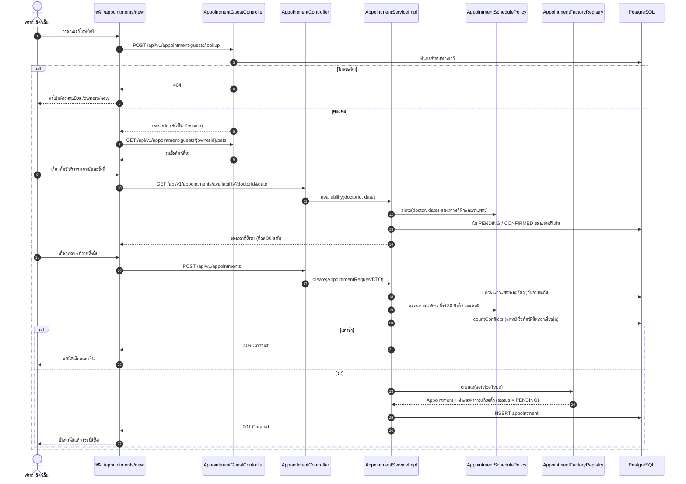
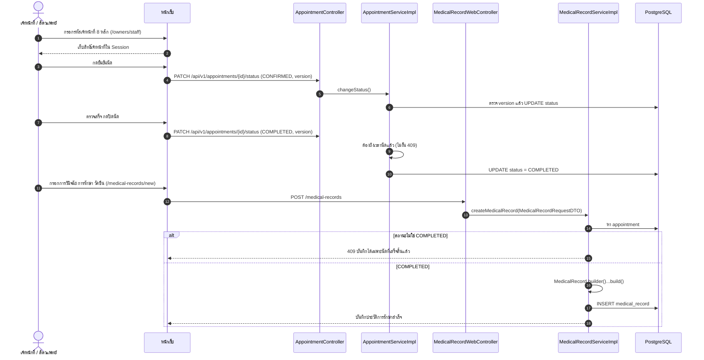

# Sequence Diagram

## 1. เจ้าของสัตว์เลี้ยงจองนัดหมาย

```mermaid
sequenceDiagram
    autonumber
    actor Owner as เจ้าของสัตว์เลี้ยง
    participant UI as หน้า /appointments/new
    participant GC as AppointmentGuestController
    participant AC as AppointmentController
    participant AS as AppointmentServiceImpl
    participant SP as AppointmentSchedulePolicy
    participant FR as AppointmentFactoryRegistry
    participant DB as PostgreSQL

    Owner->>UI: กรอกเบอร์โทรศัพท์
    UI->>GC: POST /api/v1/appointment-guests/lookup
    GC->>DB: ค้นหาเจ้าของจากเบอร์
    alt ไม่พบแฟ้ม
        GC-->>UI: 404
        UI-->>Owner: พาไปหน้าลงทะเบียน /owners/new
    else พบแฟ้ม
        GC-->>UI: ownerId (จำไว้ใน Session)
        UI->>GC: GET /api/v1/appointment-guests/{ownerId}/pets
        GC-->>UI: รายชื่อสัตว์เลี้ยง
        Owner->>UI: เลือกสัตว์ บริการ แพทย์ และวันที่
        UI->>AC: GET /api/v1/appointments/availability?doctorId&date
        AC->>AS: availability(doctorId, date)
        AS->>SP: slots(doctor, date) ตามเวลาคลินิกและเวรแพทย์
        AS->>DB: นัด PENDING / CONFIRMED ของแพทย์วันนั้น
        AS-->>UI: ช่องเวลาที่ยังว่าง (ทีละ 30 นาที)
        Owner->>UI: เลือกเวลา แล้วกดยืนยัน
        UI->>AC: POST /api/v1/appointments
        AC->>AS: create(AppointmentRequestDTO)
        AS->>DB: Lock แถวแพทย์และสัตว์ (กันจองชนกัน)
        AS->>SP: ตรวจเวลาอนาคต / ช่อง 30 นาที / เวรแพทย์
        AS->>DB: countConflicts (แพทย์หรือสัตว์มีนัดเวลาเดียวกัน)
        alt เวลาซ้ำ
            AS-->>UI: 409 Conflict
            UI-->>Owner: แจ้งให้เลือกเวลาอื่น
        else ว่าง
            AS->>FR: create(serviceType)
            FR-->>AS: Appointment + คำแนะนำการเตรียมตัว (status = PENDING)
            AS->>DB: INSERT appointment
            AS-->>UI: 201 Created
            UI-->>Owner: บันทึกนัดแล้ว (รอยืนยัน)
        end
    end
```

## 2. เจ้าหน้าที่ปิดนัดและบันทึกประวัติการรักษา

```mermaid
sequenceDiagram
    autonumber
    actor Staff as เจ้าหน้าที่ / สัตวแพทย์
    participant UI as หน้าเว็บ
    participant AC as AppointmentController
    participant AS as AppointmentServiceImpl
    participant MW as MedicalRecordWebController
    participant MS as MedicalRecordServiceImpl
    participant DB as PostgreSQL

    Staff->>UI: กรอกรหัสเจ้าหน้าที่ 8 หลัก (/owners/staff)
    UI-->>Staff: เก็บสิทธิ์เจ้าหน้าที่ใน Session
    Staff->>UI: กดยืนยันนัด
    UI->>AC: PATCH /api/v1/appointments/{id}/status (CONFIRMED, version)
    AC->>AS: changeStatus()
    AS->>DB: ตรวจ version แล้ว UPDATE status
    Staff->>UI: ตรวจเสร็จ กดปิดนัด
    UI->>AC: PATCH /api/v1/appointments/{id}/status (COMPLETED, version)
    AS->>AS: ต้องถึงเวลานัดแล้ว (ไม่งั้น 409)
    AS->>DB: UPDATE status = COMPLETED
    Staff->>UI: กรอกการวินิจฉัย การรักษา วัคซีน (/medical-records/new)
    UI->>MW: POST /medical-records
    MW->>MS: createMedicalRecord(MedicalRecordRequestDTO)
    MS->>DB: หา appointment
    alt สถานะไม่ใช่ COMPLETED
        MS-->>UI: 409 บันทึกได้เฉพาะนัดที่เสร็จสิ้นแล้ว
    else COMPLETED
        MS->>MS: MedicalRecord.builder()...build()
        MS->>DB: INSERT medical_record
        MS-->>UI: บันทึกประวัติการรักษาสำเร็จ
    end
```
