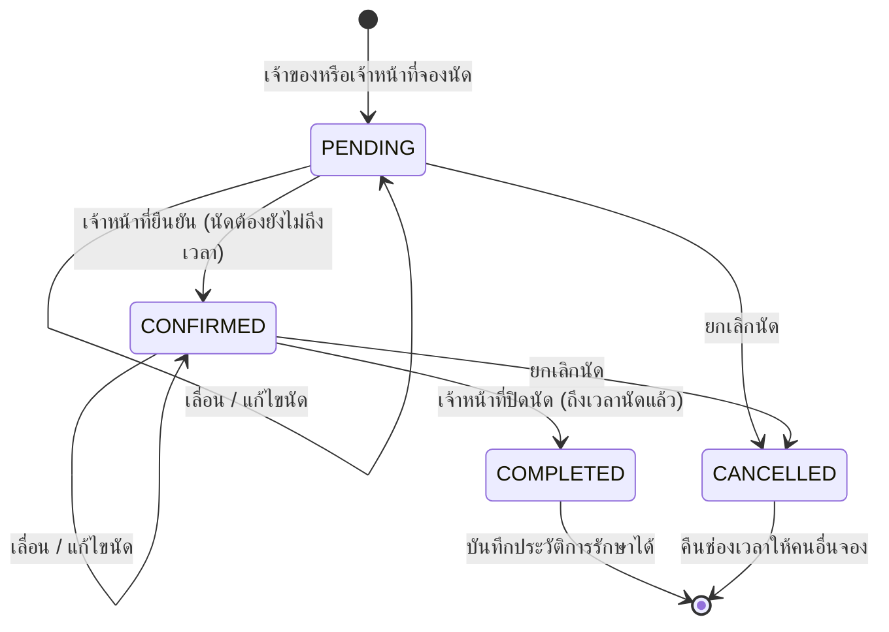

# State Diagram: สถานะนัดหมาย (`AppointmentStatus`)

| สถานะ | ความหมาย | ป้ายบนหน้าเว็บ |
| --- | --- | --- |
| `PENDING` | นัดใหม่ รอเจ้าหน้าที่ยืนยัน | รอยืนยัน |
| `CONFIRMED` | เจ้าหน้าที่ยืนยันแล้ว | ยืนยันแล้ว |
| `COMPLETED` | ตรวจเสร็จแล้ว บันทึกประวัติการรักษาได้ | เสร็จสิ้น |
| `CANCELLED` | ยกเลิกแล้ว ช่องเวลากลับมาว่าง | ยกเลิกแล้ว |

**กฎ**
* เปลี่ยนสถานะผิดลำดับ เช่น `PENDING → COMPLETED` หรือแก้ไขนัดที่ `COMPLETED` / `CANCELLED` แล้ว ตอบ **409**
* ทุกการเปลี่ยนสถานะส่ง `version` ล่าสุดมาด้วย ถ้าข้อมูลถูกแก้ไปก่อนแล้วตอบ **409** (Optimistic Locking)
* นัดที่ `PENDING` และ `CONFIRMED` นับเป็นคิวที่ใช้อยู่ ตรวจเวลาซ้ำเฉพาะ 2 สถานะนี้
