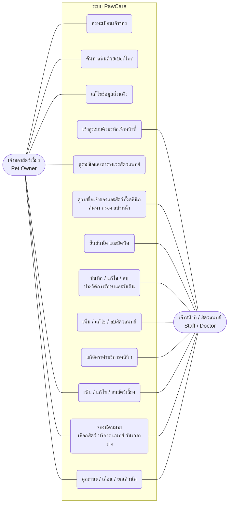

# Use Case Diagram

ผู้ใช้มี 2 กลุ่ม ระบบไม่มีการสมัครบัญชี เจ้าของสัตว์เลี้ยงเข้าแฟ้มด้วยเบอร์โทรศัพท์ เจ้าหน้าที่และสัตวแพทย์ใช้รหัสเจ้าหน้าที่ 8 หลักร่วมกัน (`STAFF_PASSCODE`)

| Use Case | ผู้ใช้ | หน้าเว็บ / API |
| --- | --- | --- |
| ลงทะเบียน / ค้นหาแฟ้ม / แก้ไขข้อมูล | เจ้าของ | `/owners`, `/owners/new`, `POST /api/v1/owners`, `GET /api/v1/owners/search` |
| จัดการสัตว์เลี้ยง | เจ้าของ (เฉพาะของตัวเอง), เจ้าหน้าที่ | `/pets`, `/api/v1/pets` |
| ดูสัตวแพทย์ | ทุกคน | `/doctors`, `GET /api/v1/doctors` |
| จอง / เลื่อน / ยกเลิกนัด | เจ้าของ (เฉพาะของตัวเอง), เจ้าหน้าที่ | `/appointments`, `/appointments/new`, `/api/v1/appointments` |
| เข้าสู่ระบบเจ้าหน้าที่ | เจ้าหน้าที่ | `/owners/staff` (ผิด 3 ครั้งใน 10 นาที ล็อกชั่วคราว) |
| ยืนยัน / ปิดนัด | เจ้าหน้าที่ | `PATCH /api/v1/appointments/{id}/status` |
| ประวัติการรักษาและวัคซีน | เจ้าหน้าที่ | `/medical-records`, `/api/v1/medical-records` |
| จัดการสัตวแพทย์ | เจ้าหน้าที่ | `/doctors` (โหมดเจ้าหน้าที่), `POST/PUT/DELETE /api/v1/doctors` |
| แก้ค่าบริการ | เจ้าหน้าที่ | `PUT /api/v1/config/fees` |
