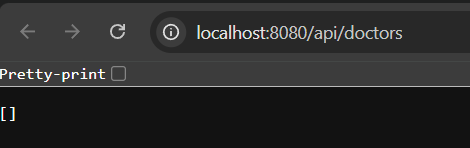
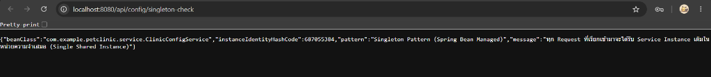

# คู่มือการรันระบบด้วย Docker และ Docker Compose

เอกสารแนะนำขั้นตอนการรันระบบคลินิกสัตว์เลี้ยง (PawCare Vet Appointment System) ผ่าน Docker และ Docker Compose

---

## 1. องค์ประกอบที่จัดทำ

1. **`code/Dockerfile`:**
   - ใช้เทคนิค **Multi-Stage Build** เพื่อลดขนาด Image
   - **Stage 1 (Builder):** ใช้ `maven:3.9-eclipse-temurin-17-alpine` ในการคอมไพล์และสร้างไฟล์ `.jar`
   - **Stage 2 (Runtime):** ใช้ `eclipse-temurin:17-jre-alpine` ซึ่งเป็น JRE ขนาดเล็ก (~150MB) รันแอปพลิเคชันอย่างปลอดภัยและมีประสิทธิภาพ
2. **`docker-compose.yml`:**
   - **Service `db` (MySQL 8.0):** ฐานข้อมูลหลักของระบบ พร้อมตั้งค่า Persistent Volume (`mysql_data`) และโหลดข้อมูลเริ่มต้นจาก `data-doctor.sql` อัตโนมัติผ่าน `/docker-entrypoint-initdb.d/`
   - **Service `app` (Spring Boot):** แอปพลิเคชันหลัก รอให้ MySQL พร้อมใช้งาน (`service_healthy`) ก่อนเริ่มทำงาน
   - มี **Healthcheck** ป้องกันปัญหา App เริ่มทำงานก่อน Database พร้อม

---

## 2. คำสั่งสำหรับรันระบบผ่าน Docker

### เริ่มต้นระบบ (Build และ Start Containers ในพื้นหลัง):
```bash
docker-compose up --build -d
```

### ตรวจสอบสถานะการทำงานของ Containers:
```bash
docker-compose ps
```

### ดู Logs การทำงานของแอปพลิเคชัน:
```bash
docker-compose logs -f app
```

### หยุดการทำงานของระบบ:
```bash
docker-compose down
```

### หยุดการทำงานและล้างข้อมูลในฐานข้อมูล (Reset ข้อมูล):
```bash
docker-compose down -v
```

---

## 3. การเข้าใช้งานระบบเมื่อรันผ่าน Docker

เมื่อสั่งรันด้วย Docker เรียบร้อยแล้ว สามารถเข้าใช้งานได้ที่:

- **หน้า UI รายชื่อสัตวแพทย์และตารางเวร:**
  👉 `http://localhost:8080/doctors.html` หรือ `http://localhost:8080/doctors`
- **REST API ข้อมูลสัตวแพทย์ (CRUD):**
  👉 `http://localhost:8080/api/doctors`
- **REST API Singleton Config (การตั้งค่าคลินิก):**
  👉 `http://localhost:8080/api/config`
  👉 `http://localhost:8080/api/config/singleton-check`
- **ฐานข้อมูล MySQL (เชื่อมต่อผ่าน DBeaver / DataGrip):**
  - Host: `localhost`
  - Port: `3306`
  - Database: `petclinic_db`
  - Username: `root`
  - Password: `rootpassword`

---

## 4. ภาพหลักฐานผลการทดสอบการรันระบบด้วย Docker

### 4.1 สถานะการรัน Containers บน Docker Desktop


### 4.2 หน้าเว็บ UI รายชื่อสัตวแพทย์และตารางเวร (PawCare)


### 4.3 ทดสอบการเรียก REST API สัตวแพทย์ (/api/doctors)


### 4.4 ทดสอบการเรียก REST API Singleton Check (/api/config/singleton-check)


