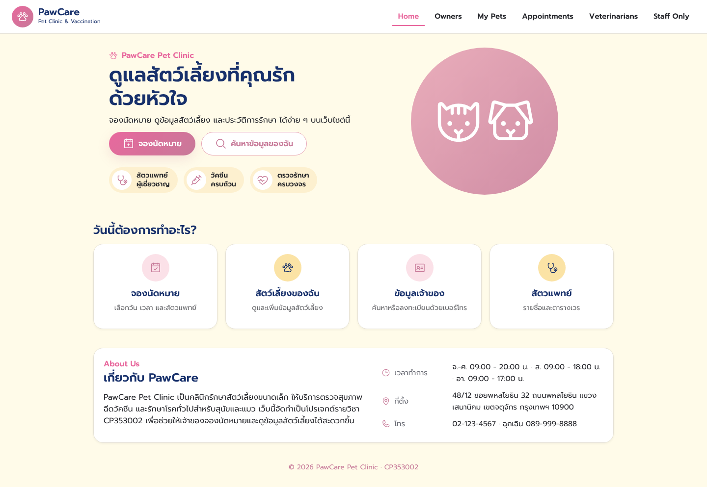
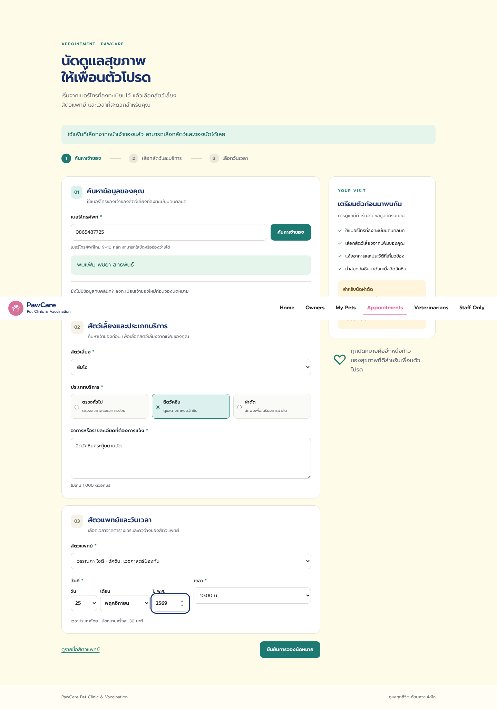
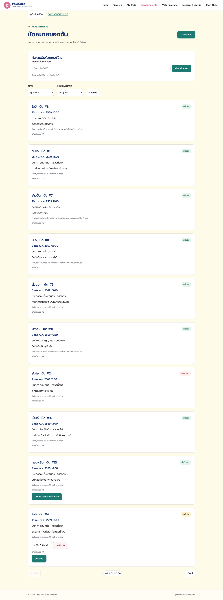
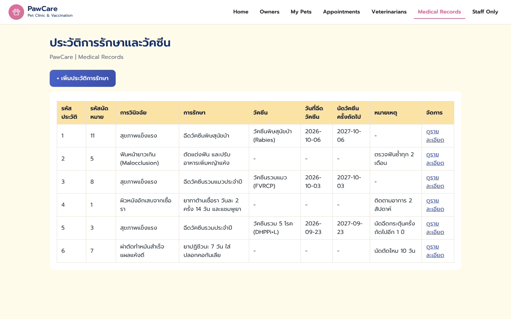

# ภาพหน้าจอระบบ PawCare

ภาพจากการรันโค้ดใน Branch `develop` กับข้อมูลตัวอย่าง (`data-sample.sql`) มี 2 ขนาด:

* `desktop/`: จอคอม กว้าง 1440px
* `mobile/`: จอมือถือ กว้าง 390px

| # | หน้า | ผู้ใช้ | Desktop | Mobile |
| --- | --- | --- | --- | --- |
| 01 | หน้าแรก | ทุกคน | [ภาพ](desktop/01-home.png) | [ภาพ](mobile/01-home.png) |
| 02 | ค้นหาแฟ้มเจ้าของด้วยเบอร์โทร | ทุกคน | [ภาพ](desktop/02-owner-search.png) | [ภาพ](mobile/02-owner-search.png) |
| 03 | ลงทะเบียนเจ้าของใหม่ | ทุกคน | [ภาพ](desktop/03-owner-register.png) | [ภาพ](mobile/03-owner-register.png) |
| 04 | รายชื่อสัตวแพทย์และตารางเวร | ทุกคน | [ภาพ](desktop/04-veterinarians.png) | [ภาพ](mobile/04-veterinarians.png) |
| 05 | เข้าสู่ระบบเจ้าหน้าที่ (Staff Only) | ทุกคน | [ภาพ](desktop/05-staff-login.png) | [ภาพ](mobile/05-staff-login.png) |
| 06 | ผลค้นหาแฟ้มเจ้าของ | เจ้าของ | [ภาพ](desktop/06-owner-search-result.png) | [ภาพ](mobile/06-owner-search-result.png) |
| 07 | แฟ้มเจ้าของสัตว์เลี้ยง | เจ้าของ | [ภาพ](desktop/07-owner-file.png) | [ภาพ](mobile/07-owner-file.png) |
| 08 | แก้ไขข้อมูลเจ้าของ | เจ้าหน้าที่ | [ภาพ](desktop/08-owner-edit.png) | [ภาพ](mobile/08-owner-edit.png) |
| 09 | สัตว์เลี้ยงของฉัน (My Pets) | เจ้าของ | [ภาพ](desktop/09-my-pets.png) | [ภาพ](mobile/09-my-pets.png) |
| 10 | จองนัดหมาย: เลือกสัตว์ บริการ แพทย์ วันที่ (พ.ศ.) และเวลาว่าง | เจ้าของ | [ภาพ](desktop/10-booking-form.png) | [ภาพ](mobile/10-booking-form.png) |
| 11 | จองนัดสำเร็จ | เจ้าของ | [ภาพ](desktop/11-booking-success.png) | [ภาพ](mobile/11-booking-success.png) |
| 12 | นัดหมายของฉัน | เจ้าของ | [ภาพ](desktop/12-my-appointments.png) | [ภาพ](mobile/12-my-appointments.png) |
| 13 | จัดการรายชื่อเจ้าของสัตว์เลี้ยง | เจ้าหน้าที่ | [ภาพ](desktop/13-staff-owner-list.png) | [ภาพ](mobile/13-staff-owner-list.png) |
| 14 | สัตว์เลี้ยงทั้งหมดในคลินิก (ค้นหา / กรอง) | เจ้าหน้าที่ | [ภาพ](desktop/14-staff-all-pets.png) | [ภาพ](mobile/14-staff-all-pets.png) |
| 15 | นัดหมายทั้งคลินิก ยืนยัน / ปิดนัด | เจ้าหน้าที่ | [ภาพ](desktop/15-staff-appointments.png) | [ภาพ](mobile/15-staff-appointments.png) |
| 16 | จัดการข้อมูลสัตวแพทย์ | เจ้าหน้าที่ | [ภาพ](desktop/16-staff-veterinarians.png) | [ภาพ](mobile/16-staff-veterinarians.png) |
| 17 | รายการประวัติการรักษาและวัคซีน | เจ้าหน้าที่ | [ภาพ](desktop/17-medical-records.png) | [ภาพ](mobile/17-medical-records.png) |
| 18 | รายละเอียดประวัติการรักษา | เจ้าหน้าที่ | [ภาพ](desktop/18-medical-record-detail.png) | [ภาพ](mobile/18-medical-record-detail.png) |
| 19 | เพิ่มประวัติการรักษา | เจ้าหน้าที่ | [ภาพ](desktop/19-medical-record-new.png) | [ภาพ](mobile/19-medical-record-new.png) |
| 20 | แก้ไขประวัติการรักษา | เจ้าหน้าที่ | [ภาพ](desktop/20-medical-record-edit.png) | [ภาพ](mobile/20-medical-record-edit.png) |
| 21 | เอกสาร REST API (Swagger UI) | ทุกคน | [ภาพ](desktop/21-swagger-api.png) | [ภาพ](mobile/21-swagger-api.png) |

## ตัวอย่าง

### หน้าแรก

### จองนัดหมาย

### นัดหมายทั้งคลินิก (เจ้าหน้าที่)

### ประวัติการรักษาและวัคซีน

