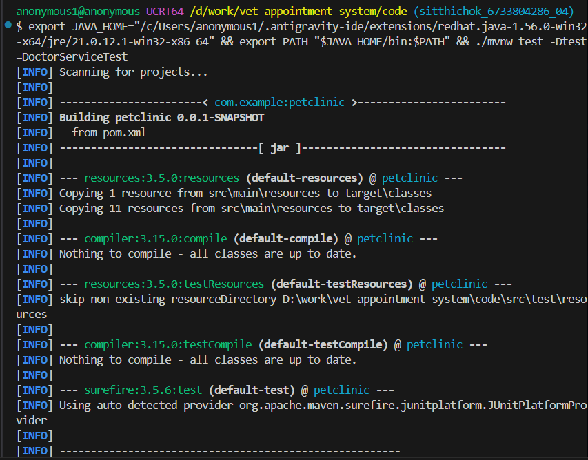
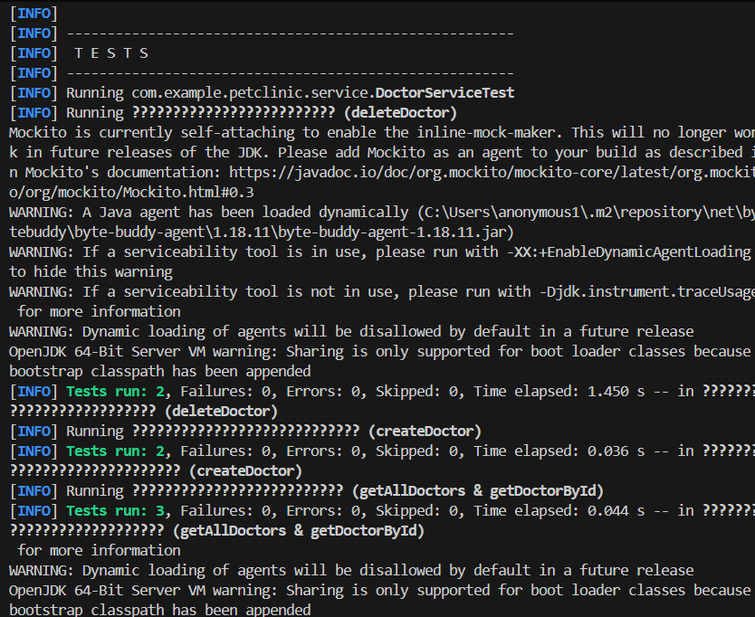
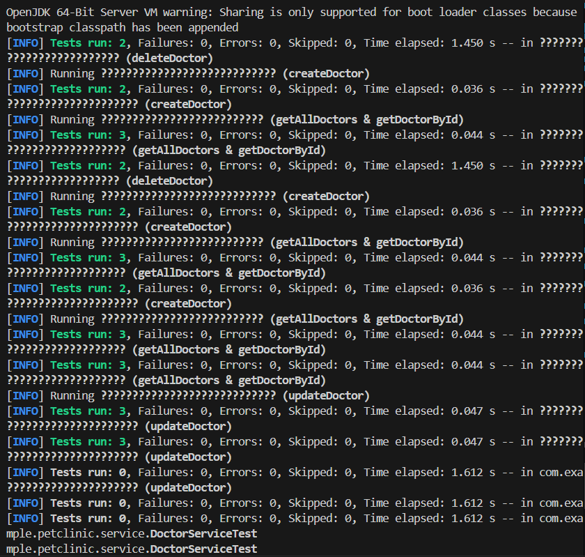
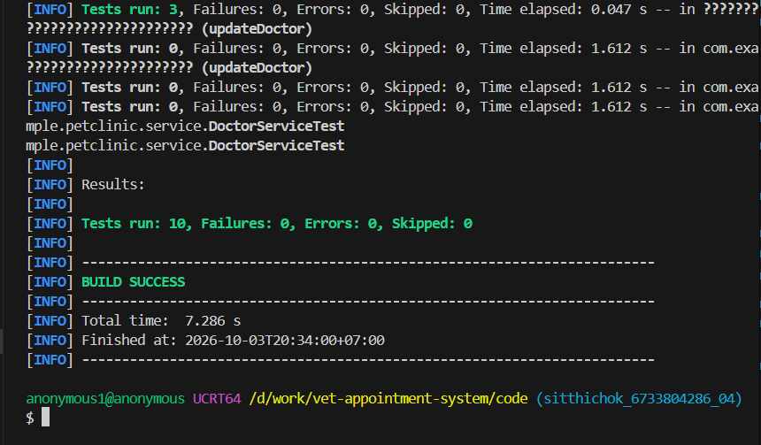
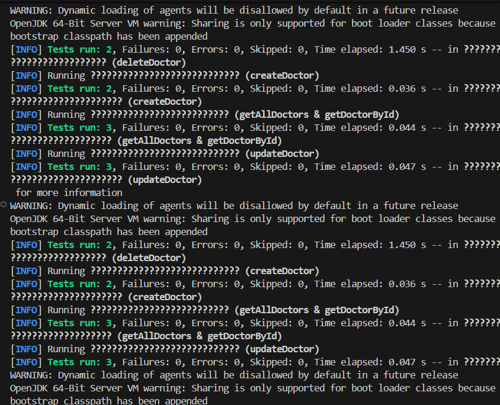
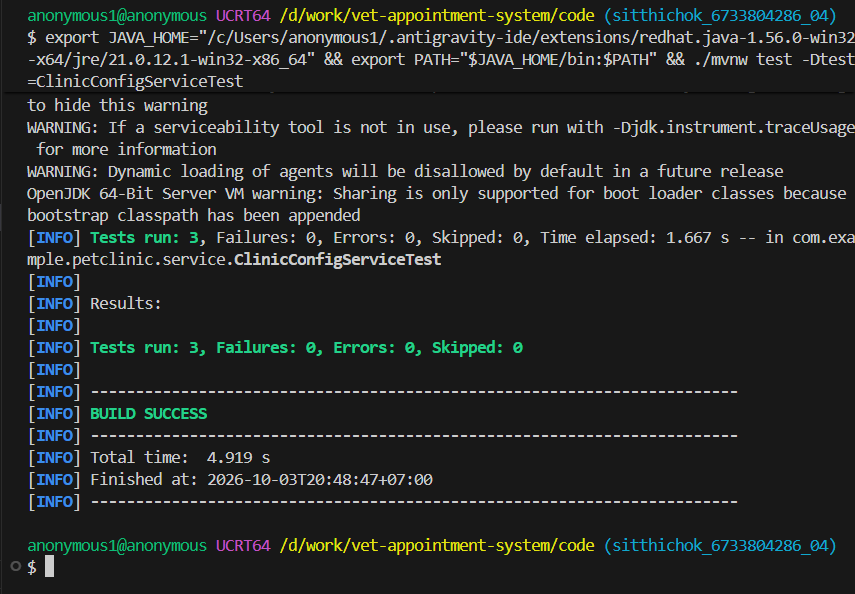
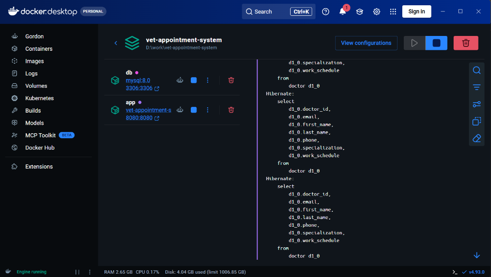
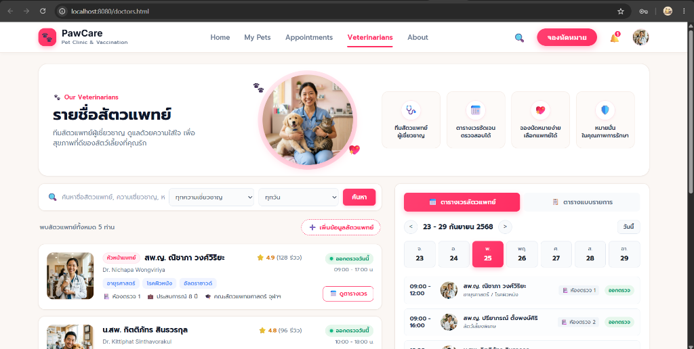

# DoctorService Unit Test Results

เอกสารผลการทดสอบ Unit Test สำหรับ `DoctorService` ด้วย **JUnit 5**, **Mockito** และ **AssertJ**

## สรุปผลการทดสอบ

- **Class ทดสอบ:** `com.example.petclinic.service.DoctorServiceTest`
- **จำนวน Test ทั้งหมด:** 10 Tests
- **Failures:** 0
- **Errors:** 0
- **Skipped:** 0
- **สถานะ:** `BUILD SUCCESS` (ผ่าน 100%)

---

## ภาพหลักฐานผลการทดสอบ

### 1. คำสั่งรันเทสต์

### 2. การดำเนินการทดสอบ

### 3. ผลการทดสอบแต่ละ Method

### 4. สรุปผลการทดสอบ BUILD SUCCESS (10 ผ่านทั้งหมด)

### 5. รายละเอียดการทำงานของ Unit Test

---

# ClinicConfigService (Singleton Pattern) Unit Test Results

เอกสารผลการทดสอบ Unit Test สำหรับการพิสูจน์ **Singleton Pattern** ผ่าน Spring Bean ด้วย **JUnit 5**, **SpringExtension** และ **AssertJ**

## สรุปผลการทดสอบ

- **Class ทดสอบ:** `com.example.petclinic.service.ClinicConfigServiceTest`
- **จำนวน Test ทั้งหมด:** 3 Tests
- **Failures:** 0
- **Errors:** 0
- **Skipped:** 0
- **สถานะ:** `BUILD SUCCESS` (ผ่าน 100%)

### 6. ผลการทดสอบ Singleton Pattern (BUILD SUCCESS)

---

# Docker Containerization Test Results

เอกสารผลการทดสอบการรันระบบแบบ Containerization ด้วย **Docker** และ **Docker Compose** ร่วมกับฐานข้อมูล PostgreSQL 15

## สรุปผลการทดสอบ

- **Container Services:** 
  - `vet-postgres-db` (PostgreSQL 15 - Port 5432) -> สถานะ: `Healthy`
  - `vet-appointment-app` (Spring Boot Java 17 - Port 8080) -> สถานะ: `Up (running)`
- **ผลการทดสอบ HTTP Endpoints:**
  - `http://localhost:8080/doctors.html` -> `200 OK` (Web UI แสดงผลครบถ้วนสมบูรณ์)
  - `http://localhost:8080/api/doctors` -> `200 OK` (REST API สัตวแพทย์)
  - `http://localhost:8080/api/config/singleton-check` -> `200 OK` (Singleton Instance Verification)

---

## ภาพหลักฐานผลการทดสอบ Docker

### 7. สถานะ Containers ใน Docker Desktop และ Database Logs
แสดงสถานะ Containers และ `vet-appointment-app` (Port 8080) รันทำงานพร้อมกัน และ Hibernate ดำเนินการคิวรี่ตาราง `doctor` อัตโนมัติ:

### 8. ผลการเรียกใช้งานหน้าเว็บ UI ผ่าน Docker (Port 8080)
หน้าเว็บ PawCare Veterinarians แสดงข้อมูลรายชื่อสัตวแพทย์และตารางเวรสมบูรณ์:

### 9. ผลการทดสอบ REST API สัตวแพทย์ (/api/doctors)
ทดสอบเรียกดูข้อมูลสัตวแพทย์ผ่าน REST API ใน Container:

### 10. ผลการทดสอบ REST API Singleton Pattern (/api/config/singleton-check)
ทดสอบเรียกดู Instance Identity HashCode และข้อความยืนยัน Single Shared Instance:

